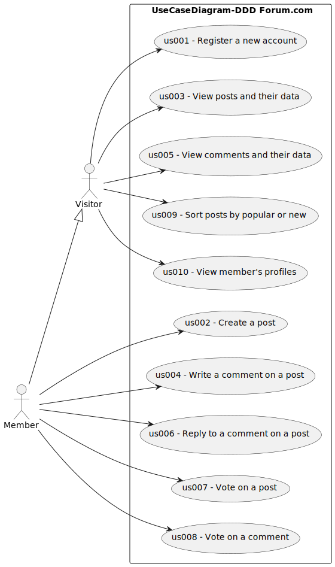

# Use Case Diagram (UCD)

**In the scope of this project, there is a relationship of 1 User Story (US) to N Use Cases (UC) .**

Please, be aware that along our documentation, we refer to US as high-level/semantic description of the client request. Taking that into account, every US documented in our project are associated to multiple UC's that are fine grained.

Note that group project considered Login/Logout as a non-functional requirement for the client, therefore that matter is described in detail on the suplementary-specification.

# Use Cases / User Stories

| UC/US  | Description                  |
| :----- | :--------------------------- |
| us001 | [Register a new account](/docs//sprintA/us001/readme.md) |
| us002 | [Create a post](/docs//sprintA/us002/readme.md) |
| us003 | [View posts and their data](/docs//sprintA/us003/readme.md) |
| us004 | [Write a comment on a post](/docs//sprintA/us004/readme.md) |
| us005 | [View comments and their data](/docs//sprintA/us005/readme.md) |
| us006 | [Reply to a comment on a post](/docs//sprintA/us006/readme.md) |
| us007 | [Vote on a post](/docs//sprintA/us007/readme.md) |
| us008 | [Vote on a comment](/docs//sprintA/us008/readme.md) |
| us009 | [Sort posts by popular or new](/docs//sprintA/us009/readme.md) |
| us010 | [View member's profiles](/docs//sprintA/us010/readme.md) |