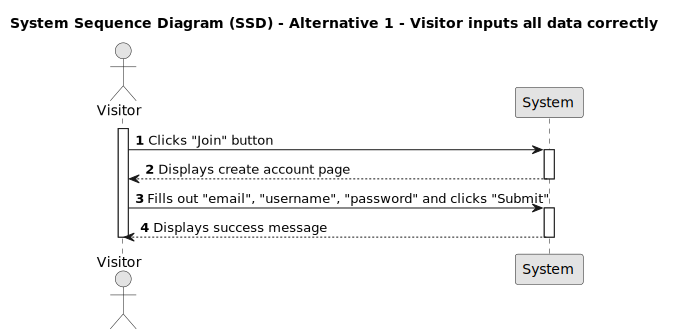

# US 001 - Register a new account

## 1. Requirements Engineering

### 1.1. User Story Description

- As a visitor, I want to register a new account so that I can become a member.

### 1.2. Customer Specifications and Clarifications

- What information is required for registration?

- Are there any specific validation rules for the registration fields?

- Should there be a confirmation step, such as email verification, to complete the registration process?

- Are there any restrictions on who can register?

- Should there be any terms of service or agreements that the user needs to accept during registration?

- How should the system handle errors during the registration process?

### 1.3. Acceptance Criteria

- **AC1:** Email parameter should be unique and follow RFCs specific syntax rules: include a local part (username) followed by an at symbol (@), the domain part and the top-leven domain.

- **AC2:** The username parameter must contain at least two characters and a maximum of 15.

- **AC3:** The username or email parameter must be unique.

- **AC4:** The password parameter must have at least six characters.

- **AC5:** All parameters are mandatory.

- **AC6:** When all the parameters fulfill the criteria, a message must be displayed, and the member will be automatically logged in
  ("You're all signed up! Logging you in. 🤠" followed by another separate message "Logged in! 🤠").

### 1.4. Found out Dependencies

- Any updates or changes may impact the registration flow and require coordination with the design and front-end development teams.

- Registration must properly integrate with the login method, which is username/password. Password encryption and storage should be taken into account during registration implementation.

- Database tables, columns, and relationships must be well established or updated to support account registration.

- Appropriate error handling mechanisms must be implemented to provide visibility into potential issues.

- Legal or compliance dependencies must be must be considered when registering an account, like GDPR. Registration process must aligns with the necessary regulations and policies.

### 1.5 Input and Output Data

**Input Data:**

- Typed data:

  - e-mail;
  - username;
  - password;

- Selected data:
  - none;

**Output Data:**

- When the registration meets the criteria an account must be created.
- After creating the account, the visitor must be automatically logged in as a member.
- When the registration doesn't meet the minimum requirements, an unsuccess message must appear ".

### 1.6. System Sequence Diagram (SSD)

#### Alternative One

### 1.7 Other Relevant Remarks

n/a

### 1.8 Bugs

n/a
