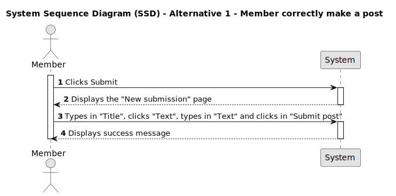
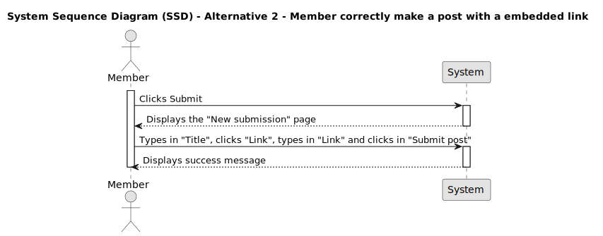

# US 002 - Create a post

## 1. Requirements Engineering

### 1.1. User Story Description

As a Member,
I want to create a post
so that I can post my content on DDD Forum

### 1.2. Customer Specifications and Clarifications

- What type of content can be submitted?
- Are there any specific requirements or limitations for the submitted content?
- What steps are involved in creating a post?
- Are there any mandatory fields or information that need to be provided during the post process?
- Should users receive a notification upon successful post?
- Should there be any metrics associated with posts, such as a voting count?

### 1.3. Acceptance Criteria

- **AC1:** Member must be logged in.

- **AC2** Clicking submit in the main page must redirect member to post creation page.

- **AC3** The field tittle must contain at least 2 to max 85 characters to be valid and posted.

- **AC4** The field text must contain at least 20 to max 10000 characters to be valid and posted.

- **AC5** The field link must contain an extension at the end (".pt") and at least 8 to 500 characters to be valid and posted.

- **AC6** The post must be saved and showed on the main page.

### 1.3.1 Acceptance Criteria BackEnd

- **AC7** The field text must contain at least 2 to max 10000 characters to be valid and posted.

- **AC8** The field link must contain an extension at the end without any numbers (".pt") and at least 4 to 66 characters to be valid and posted.

### 1.4. Found out Dependencies

_There is a dependency to "US001 - As a visitor, I want to register a new account so that I can become a member._

- The post creation process depends on login mechanism.

- Any updates or changes may impact the post creation flow and require coordination with the design and front-end development teams.

- The post data needs to be stored in a data storage system. There should be a database schema and tables for storing post-related information.

- Appropriate error handling mechanisms must be implemented to provide visibility into potential issues.

### 1.5 Input and Output Data

**Input data**

- Select data:
  - "submit";
  - "Submit post";

**Output data**

- When the post meets the criteria, a success message must appear.
- After creating the post, the member must be redirected to the main page.
- When the post doesn't meet the minimum requirements to be created, an insuccess message must appear.

### 1.6. System Sequence Diagram (SSD)

#### Alternative One

#### Alternative Two

### 1.7 Other Relevant Remarks

None.

## 2. Identifying Bugs

### 2.1 Bugs Found

The bugs we've identified in this user story are linked to acceptance criteria number 4, where the API back-end sets the wrong minimum limits in the text body input and incorrectly includes HTML tags in the character count. These issues have adverse effects on the user experience by creating inaccuracies in character counting and potentially resulting in submission errors.
This can be a source of user discontent and disrupt a smooth interaction with the platform.

### 2.2 Sequence Diagram

We created a comprehensive sequence diagram that offers demonstrates how the post creation process works within our API. This diagram provides a clear and organized visual representation, demonstrating the precise interactions between objects, classes, and methods. It serves as a valuable tool for understanding the flow of data and actions that occur when a post is created, allowing for a deeper comprehension of the API workings.

### 2.3 Fix

We initially encountered a bug where the API's back-end was setting the wrong minimum input limits for the post body. By going into the `postText` class and changing the `minLength` variable from 2 to 20, the problem was solved.

#### minLength and maxLengh

#### Commit PostText minLengh fix

By filtering through the body field and stripping it of any tags before proceeding with the post creation, we can ensure that the character count is correct, and the functionality works as intended. To achieve this, we implemented a function called `stripHtml` within the `postText` class. This function executes a `replace` method that uses a regular expression matching any HTML tag (including its content) and replaces it with an empty string. Essentially, it removes all HTML tags from the input string, leaving only the text content.
This issue didn't affect the back-end since the tags were added exclusively on the front-end. However, we decided to develop a solution to address it.

#### Method stripHtml

#### With method stripHtml

#### Commit HTML tag fix

### 2.4 Tests

After fixing the bug, we needed to update the previously written texts that were based on the incorrect character limit.

#### Test Suit Limits Update

