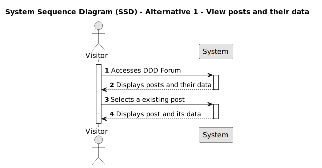

# US 003 - View posts and their data

## 1. Requirements Engineering

### 1.1. User Story Description

As a Visitor,
I want to view the submissions data
so that I can analyze and gain insights from the collected information.

### 1.2. Customer Specifications and Clarifications

- What information should be included for each post?
- What's the preferred method for navigating through posts, pagination or infinite scroll? Clarify the number of posts to be displayed per page or per scroll.
- Are there any limitations on who can view post details?

### 1.3. Acceptance Criteria

**AC1:** As a visitor, I can access the platform without the need for registration or authentication.

**AC2:** As a visitor, I can see all posts displayed along the feed with the following information:

- Score of each post
- Title of each post
- Timestamp indicating when each post was created
- Username of the member who created each post
- Number of comments on each post

**AC3:** As a visitor, I can click on a post from the posts feed and be redirected to a dedicated page for that post.

**AC4:** On the post page, I can view the full details of the post, including:

- Full content of the post
- Embedded links
- Comment box
- Comment section

### 1.4. Found out Dependencies

_There is a dependency to user story 002: Create a post._

- DDD Forum should allow unauthenticated users (visitors) to navigate through the website and view posts and their data without requiring them to authenticate.

- The system requires a user interface through which visitors can access and view the posts. The posts and their data should be presented in a simple and clear format to enhance the user experience.

- There should be a database to store the posts and their associated data. A mechanism to retrieve the posts from the database or storage and present them to the visitor is also needed.

- Appropriate error-handling mechanisms must be implemented to provide visibility into potential issues.

### 1.5 Input and Output Data

**Input Data:**

- Selected data:
  - A post.

**Output Data:**

- post data.

### 1.6. System Sequence Diagram (SSD)

#### Alternative One

### 1.7 Other Relevant Remarks

n/a
