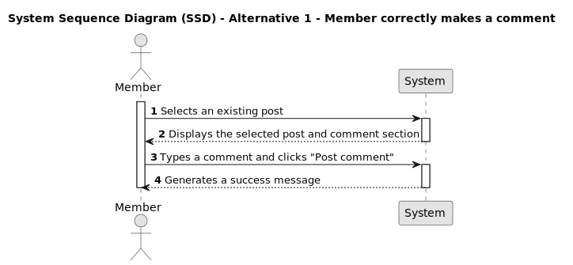

# US 004 - Write a comment on a post

## 1. Requirements Engineering

### 1.1. User Story Description

As a Member,
I want to write a comment on a post
so that I can give my insights to the post.

### 1.2. Customer Specifications and Clarifications

- Should comments be visible to all users?
- Does the user need to be logged in to their account in order to write a comment on a post?
- Are there any limitations on the length of the comment, such as maximum and minimum characters?
- Are there any specific formatting options available for the comment, such as bold or italic text?
- How should comments be sorted and displayed?
- Should there be a limit on the number of comments displayed per page?

### 1.3. Acceptance Criteria

- **AC1:** The member must be logged in.

- **AC2:** Select an existing post to write a comment.

- **AC3:** The comment must contain at least 20 characters and a maximum of 10000 characters.

- **AC4:** When the comment is fewer than 20 characters or higher than 10000 characters an unsuccess message must be displayed ("Yeahhhhh, comments should be 20 to 1z00 characters. Yours was xxx. 🤠")

- **AC4:** When the comment is created a success notification must appear ("Done-zo! 🤠")

### 1.4. Found out Dependencies

_There is a dependency to "US001 - As a visitor, I want to register a new account" since only members can make comments._
_There is a dependency to "US002 - As a member, I want to creat a post" since a post must already exist._

- The system should provide a means for the user to access the specific post they wish to comment on.

- The system needs to validate the comment to ensure it adheres to any specified requirements, such as length constraints or content guidelines.

### 1.5 Input and Output Data

**Input data**

- Typed data:
  - comment;
- Selected data:
  - post;

**Output data**

- When the comment atendeds the criteria a display success message.
- The comment should be displayed.
- When the comment doesn't have the minimum requirements to be posted, an error message should be displayed.

### 1.6. System Sequence Diagram (SSD)

#### Alternative One

### 1.7 Other Relevant Remarks

none.

### 1.8 Bugs

- AC3 - In the comment section, we noticed that 1 character that is in italic, counts as 10 characters.
- AC3 - In the comment section, we noticed that 1 character that is underlined, counts as 8 characters. 
- AC3 - In the comment section, we noticed that one character that is in bold, counts at least as 13 characters. 