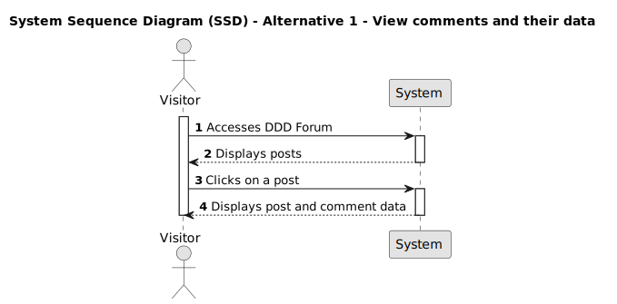
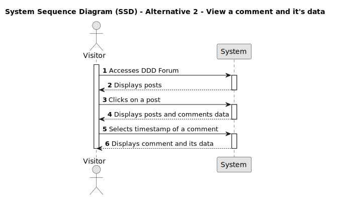

# US 005 - View comments and their data

## 1. Requirements Engineering

### 1.1. User Story Description

- As a visitor, I want to view comments and their data.

### 1.2. Customer Specifications and Clarifications

- Are there restrictions on comment visibility and data access?
- Should it be open to all users or limited to specific roles/permissions?
- Are there performance factors to consider, like comment loading time?
- What additional data should accompany the comments?

### 1.3. Acceptance Criteria

**AC1:** As a visitor, I can access the platform without the need for registration or authentication.

**AC2:** As a visitor, I can navigate through the posts feed and see all posts displayed along with their data.

**AC3:** As a visitor, I can click on a post from the posts feed and be redirected to a dedicated page for that post.

**AC4:** Under the comment box, A comment section must exist with all comments and comment replies for that specific post.

**AC5:** Every comment must show the following data:

- Comment text.
- Username of the user that commented.
- The timestamp regarding when the comment was made.
- Score value and its respective up/down arrows.
- Reply option.

### 1.4. Found out Dependencies

_Dependencies to user story 002: Create a post._
_Dependencies to user story 004: Create a comment._
_Dependencies to user story 006: Reply to a comment on a post_

- Forum should allow visitors to navigate through the website and view posts and their data without requiring them to authenticate.

- There should be a database table to store the comments and their associated data. A mechanism to retrieve the comments from the database or storage and present them to the visitor is also needed.

- Appropriate error-handling mechanisms must be implemented to provide visibility into potential issues.

### 1.5 Input and Output Data

**Input Data:**

- Selected data:
  - A post

**Output Data:**

- Post data
- Comments
- Replies to comments
- Username of the member who made the comment
- Timestamp of the comment
- Username of the member who replied to the comment
- Timestamp of replies

### 1.6. System Sequence Diagram (SSD)

#### Alternative One

#### Alternative Two

### 1.7 Other Relevant Remarks

n/a
