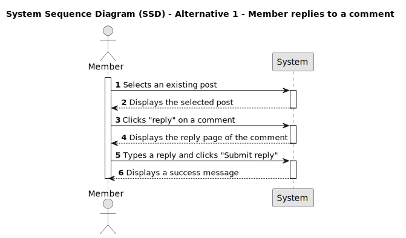
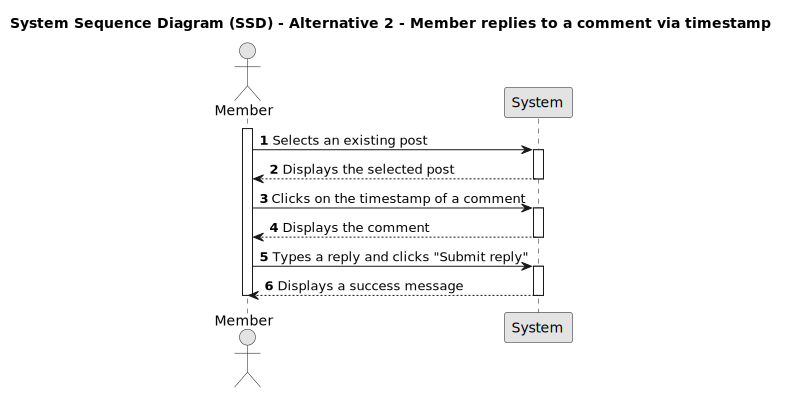

# US 006 - Reply to a comment on a post

## 1. Requirements Engineering

### 1.1. User Story Description

As a Member,
I want to reply to a comment on a post,
so that I can actively participate in the conversation and provide my input, thoughts, or feedback.

### 1.2. Customer Specifications and Clarifications

- Does the user need to be logged in to their account in order to write a reply on a comment?

- What type of media does the post consist of (e.g., text, image, video)?

- Are there any limitations on the length of the reply, such as maximum character or word count?

- Are there any restrictions on the content of the reply, such as avoiding profanity or offensive language?

- Are there any specific formatting options available for the reply, such as bold or italic text?

### 1.3. Acceptance Criteria

- **AC1:** The member must be logged in.

- **AC2:** Member must be able to select a comment of a selected post.

- **AC3:** A reply option must exist in the comment.

- **AC4:** The reply must have a minimum of 20 characters and a maximum of 10000 characters to be valid.

- **AC5:** When the reply is fewer than 20 characters or higher than 10000 characters an unsuccess message must be displayed.

### 1.3.1. Acceptance Criteria BackEnd 

- **AC4** The field text must contain at least 2 to max 10000 characters to be valid and posted.

### 1.4. Found out Dependencies

_There is a dependency to "US001 - As a visitor, I want to register a new account" since only members can make replies._
_There is a dependency to "US002 - Create a post" since a post must already exist._
_There is a dependency to "US003 - View posts and their data"._
_There is a dependency to "US004 - Write a comment on a post" since a comment must already exist._
_There is a dependency to "US005 - View comments and their data"_

- The system must validate the reply to ensure it meets the specified requirements such as length limits.

### 1.5 Input and Output Data

**Input data**

- Typed data:

  - A reply

- Selected data:
  - A post;
  - A comment;

**Output data**

- Display a success message.
- The reply to the comment and their data must be displayed.
- When the post doesn't have the minimum requirements, an unsuccess message must be displayed.

### 1.6. System Sequence Diagram (SSD)

#### Alternative One

#### Alternative Two

### 1.7 Other Relevant Remarks

n/a

### 1.8 Bugs

- AC4 - In the reply, we noticed that 1 character that is in italic, counts as 10 characters.
- AC4 - In the reply, we noticed that 1 character that is underlined, counts as 8 characters. 
- AC4 - In the reply, we noticed that one character that is in bold, counts at least as 13 characters. 
