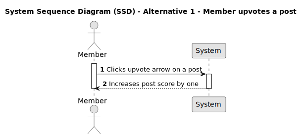
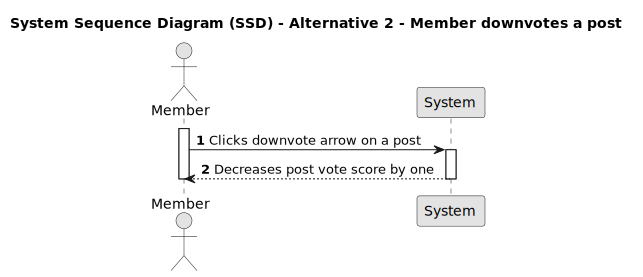
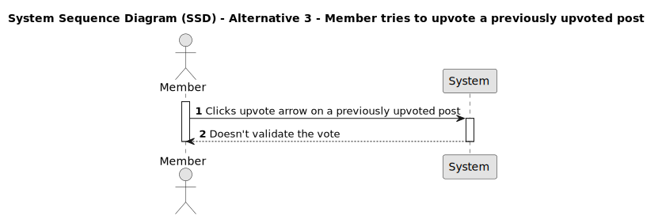
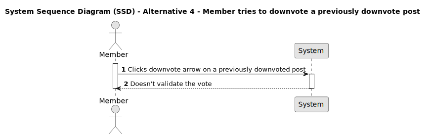
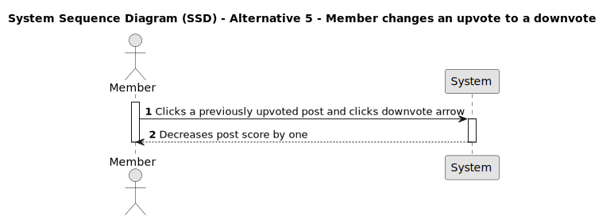
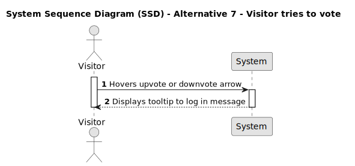

# US 007 - Vote on a post

## 1. Requirements Engineering

### 1.1. User Story Description

As a Member,
I want to vote on a post,
so that I can express my appreciation of the post and contribute to its score.

### 1.2. Customer Specifications and Clarifications

- Should a visitor be able to see the vote arrows?
- Should score be visible to visitors?
- Is there any restriction on the time period within which a member can cast or change their vote on a post?
- Is the voting supposed to be anonymous?
- Should there be any visual indication for the members to see their own previous votes?

### 1.3. Acceptance Criteria

- **AC1:** Member must be logged in.

- **AC2:** A post must already exists.

- **AC3:** The vote arrows must function on the mainpage as well as inside the post page.

- **AC3:** Clicking the upvote arrow must increase the post score by one.

- **AC4:** Clicking the downvote arrow must decrease the post score by one.

- **AC5:** Given that the member has already upvoted a post and clicks the upvote arrow again, the upvote must decrease the post score by one.

- **AC6:** Given that the member has already downvoted a post and clicks the downward arrow again, the downvote must be increase the post score by one.

- **AC7:** Given that the member has already upvoted a post and then clicks the downvote arrow, the post's score must decrease by one.

- **AC8:** Given that the member has already downvoted a post and then clicks the upvote arrow, the post's score must increase by one.

### 1.4. Found out Dependencies

_There is a dependency to "US011 - Login" since the member must be logged in._
_There is a dependency to "US003 - View posts and their data" since a post must already exist._

### 1.5 Input and Output Data

**Input Data:**

- Selected data:
  - Upvote arrow;
  - Downvote arrow;

**Output Data:**

- Post score.

### 1.6. System Sequence Diagram (SSD)

#### Alternative One

#### Alternative Two

#### Alternative Three

#### Alternative Four

#### Alternative Five

#### Alternative Six

#### Alternative Seven

### 1.7 Other Relevant Remarks

- The UI accepts the upvote or downvote, even if the member has already upvoted or downvoted respectively the post. And the backend rejects this afterwards. This does not seem to be the best practice.

### 1.8 Bugs

## 1. Score value changes
  - [SD](../03.sequence-diagram/us007_upvote_already_upvoted.png)

  - [Solution](../../../../sprintC/images/noFix3.png)
    ### 1.1 Clues

  - [Clue 1](../../../../../src/modules/forum/domain/post.ts#L241)

  - [Clue 2](../../../../sprintC/images/initialVoteHappens.png)

  - ["Fita cola preta" Solution](../../../../sprintC/images/upvote_aFix.png)