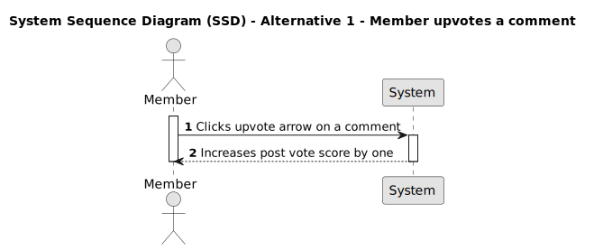
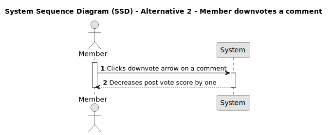
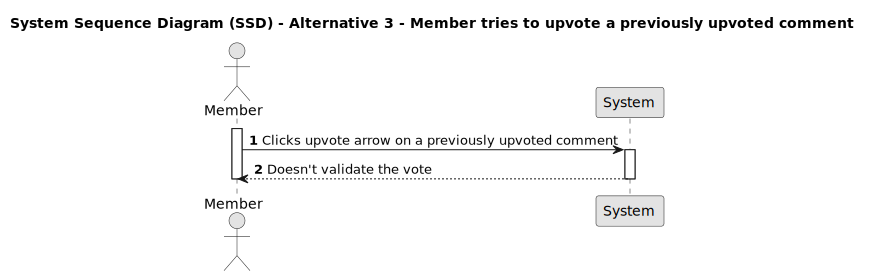
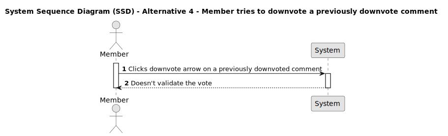
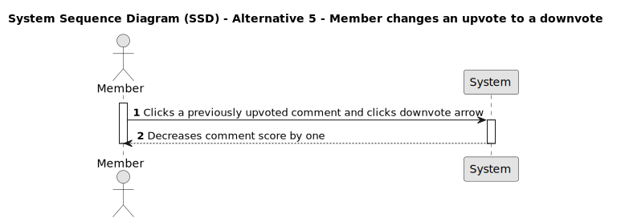
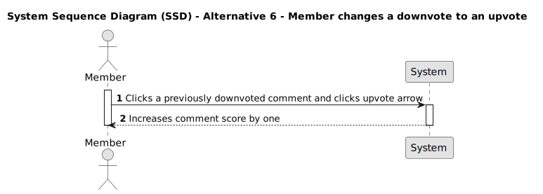
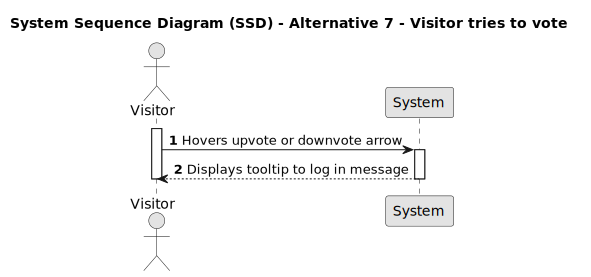
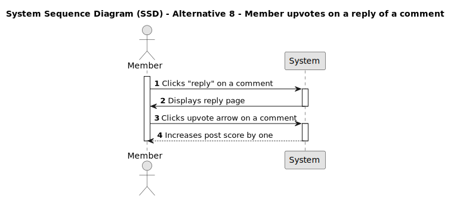
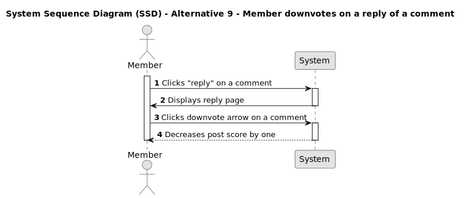

# US 008 - Vote on a comment

## 1. Requirements Engineering

### 1.1. User Story Description

As a Member,
I want to vote on a comment,
so that I can express my appreciation of the comment and contribute to its evaluation.

### 1.2. Customer Specifications and Clarifications

- Should a visitor user be able to see the vote arrows?
- Should score be visible to visitors?
- Is there any restriction on the time period within which a member can cast or change their vote on a comment?
- Is the voting supposed to be anonymous?
- Should there be any visual indication for the users to see their own previous votes?

### 1.3. Acceptance Criteria

- **AC1:** Member must be logged in.

- **AC2:** A comment must already exist.

- **AC3:** A vote must be able to be made on the post page on all comments.

- **AC4:** A vote must be able to be made on the page "reply to a comment" as described on us006.

- **AC5:** Clicking the upvote arrow must increase the comment score by one.

- **AC6:** Clicking the downvote arrow must decrease the comment score by one.

- **AC7:** Given that the member has already upvoted a comment and clicks the upvote arrow again, the upvote must be ignored and the comment's score must not change.

- **AC8:** Given that the member has already downvoted a comment and clicks the downvote arrow again, the downvote must be removed and the comment's score must not change.

- **AC9:** Given that the member has already upvoted a comment and then clicks the downvote arrow, the upvote must be removed, and the comment's score must decrease by one.

- **AC10:** Given that the member has already downvoted a comment and then clicks the upvote arrow, the downvote must be removed, and the comment's score must increase by one.

- **AC11:** The updated score value should be immediately visible to the member after a vote has been cast.

### 1.4. Found out Dependencies

- _There is a dependency to "US002 - Create a post" since a post must already exists._
- _There is a dependency to "US003 - View posts and their data" since a post must already exists._
- _There is a dependency to "US005 - View comments and their data" since a comment must already exists._
- _There is a dependency to "US006 - Reply to a comment on a post" since a comment must already exist._

### 1.5 Input and Output Data

**Input Data:**

- Selected data:
  - Upvote arrow;
  - Downvote arrow;

**Output Data:**

- Changes to the overall comment score.

### 1.6. System Sequence Diagram (SSD)

#### Alternative One

#### Alternative Two

#### Alternative Three

#### Alternative Four

#### Alternative Five

#### Alternative Six

#### Alternative Seven

#### Alternative Eight

#### Alternative Nine

### 1.7 Other Relevant Remarks

- The UI accepts the upvote or downvote, even if the member has already upvoted or downvoted respectively the post. And the backend rejects this afterwards. This does not seem to be the best practice.

- The vote on a reply to a comment, should be able to be made on the main page of a given post.

### 1.8 Bugs

- AC5 / AC6 - Front-end - Score value does not change upon interaction with upvote and downvote arrows, only after refreshing the page does the value change or not, which is not compatible with how score value of the post works.
