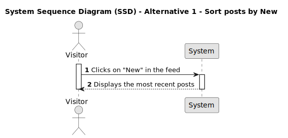
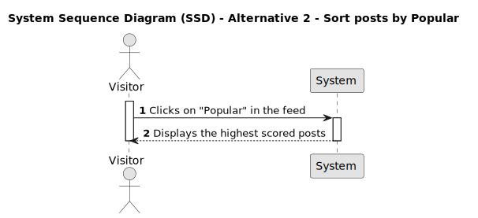
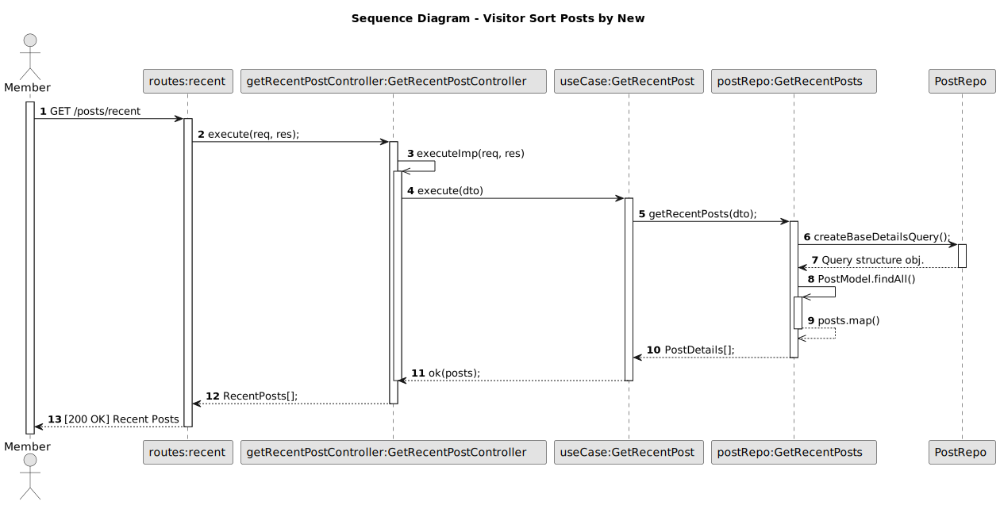

# US 009 - Sort posts by Popular or New

## 1. Requirements Engineering

### 1.1. User Story Description

As a Visitor,
I want to sort posts by popular or new,
so that I can easily find and navigate through the posts based on their popularity or recency.

### 1.2. Customer Specifications and Clarifications

- How many posts should be visible, including popular and new ones?
- Should all posts be visible?
- What happens to the oldest posts?
- If two posts have the same timestamp, which one should be visible first?
- If two posts have the same score, which one should be visible first?
- If two posts have the same score and timestamp, which one should be visible first?
- How should popular posts be displayed if they have the same score?

### 1.3. Acceptance Criteria

**AC1:** Visitor must be able to access to the DDD Forum.

**AC2:** The maximum number of posts visible to the Visitor must be 15.

**AC3:** Visitor can sort posts by popular, unpopular or new.

**AC4:** Popular posts must be ordered by highest to low score.

**AC5:** New posts must be ordered by timestamp, most recent first.

### 1.3.1. Acceptance Criteria Backend

**AC5:** New posts aren't ordered by timestamp in the backend. They are ordered in frontend.

### 1.4. Found out Dependencies

- _There is a dependency to "US002 - Create a post", since one or more posts must already exists._

* _There is a dependency to "US003 - View posts and their data", since posts must be visible to Visitor._

- _There is a dependency to "US007 - Vote on a post", since the posts must be displayed by score when sorted by popular._

### 1.5 Input and Output Data

**Input Data:**

- Typed data:
  - none
- Selected data:
  - none

**Output Data:**

- Popular posts
- New posts

### 1.6. System Sequence Diagram (SSD)

#### Alternative One

#### Alternative Two

### 1.7 Other Relevant Remarks

N/A

## 2. Bugs

### 2.1 Bugs Found

The bug we've identified in this user story is linked to acceptance criteria number 5, where the API backend doesn't order the posts by the most recent

**AC5:** New posts must be ordered by timestamp, most recent first.

### 2.2 Sequence Diagram

We created a comprehensive sequence diagram that demonstrates how the sort by recency works within our API. This diagram provides a clear and organized visual representation, demonstrating the precise interactions between objects, classes, and methods. It serves as a valuable tool for understanding the flow of data and actions that occur when a post is created, allowing for a deeper comprehension of the API workings.

### Sequence Diagram - Sort posts by New

### 2.3 Bug Fix

#### First Aproach:

#### Final Solution:

### Commit of the Solution:

## 2.4 Tests

After fixing the bug, we needed to update the previously written texts that were based on skip because otherwise they would fail.

#### Test suite before bug fix:

#### Test Sort Posts By New Fail:

#### Test Sort Posts By New:

#### Test suite after bug fix:

