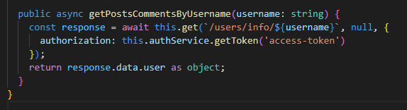

# Implementation

## New Route Created: 

## Index new use Case: 

## DTO interface: 

## Controller: 

## Use case: 

## Query for user information:

## Query for Nº1 User commenter:

## Placing the two querys together:

## UserRepo:

## UserService:

## MemberPage FrontEnd:

## Getting the wanted Information:

## Updtating Componoment:

## Getting the info to Appear in the right place

## FrontEnd View
