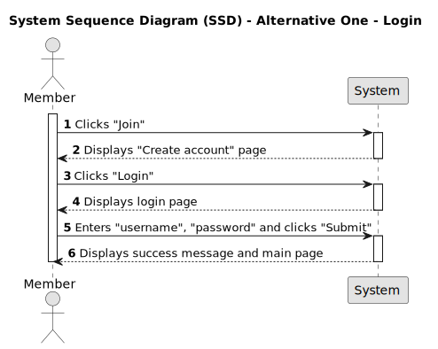
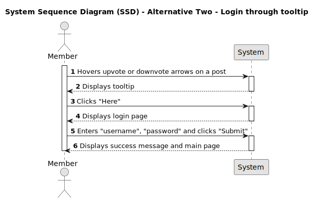
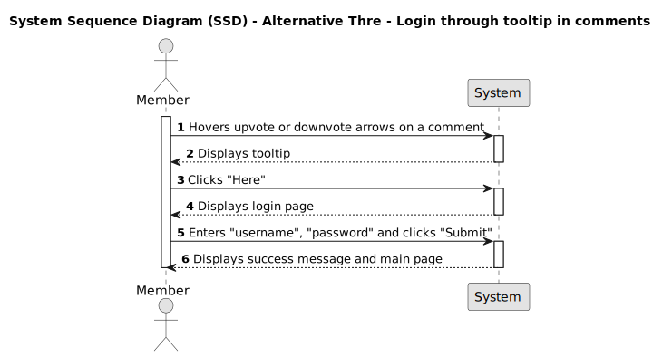

# US 011 - Login

## 1. Requirements Engineering

### 1.1. User Story Description

As a Member, I want to login into my account,
so that I can access member features and actively participate in the forum.

### 1.2. Customer Specifications and Clarifications

- Should usernames and passwords be case-sensitive?
- Should there be a limit on the number of login attempts before an account gets locked?
- Are there any specific error messages for different types of login failures?
- Can a member recover his password if he forgets it?

### 1.3. Acceptance Criteria

**AC1:** As a member, I must be able to access the DDD Forum application.

**AC2:** As a member, I must have a previously created account to log into.

**AC3:** As a member, I must be prompted to enter my login information: username and password.

**AC4:** As a member, when I enter the correct login information, I must be successfully logged into my account and the following notification must appear ("Logged in! 🤠").

**AC5:** As a member, when I enter incorrect login information, I must receive an unsuccess notification indicating that the login details are incorrect ("Had some trouble loggin in! Password doenst match error. 🤠").

### 1.4. Found out Dependencies

_There is a dependency to "US001 - As a member, I want to register a new account" since only members can make comments._

- Members need to register for an account before they can log in.
- To authenticate members securely, username and password need to be verified.
- A database is necessary to store user account information, including usernames and passwords.
- Error handling should be implemented to handle situations like incorrect login credentials.

### 1.5 Input and Output Data

**Input Data:**

- Typed data:
  - username;
  - password;
- Selected data:
  - none;

**Output Data:**

- when the credentials are correct, the member must have access to their account.
- A session is created for the logged-in user, enabling them to navigate and interact with their account and its features.
- When the login credentials are incorrect, an unsuccess notification must be displayed.

### 1.6. System Sequence Diagram (SSD)

#### Alternative One

#### Alternative Two

#### Alternative Three

### 1.7 Other Relevant Remarks

N/A
