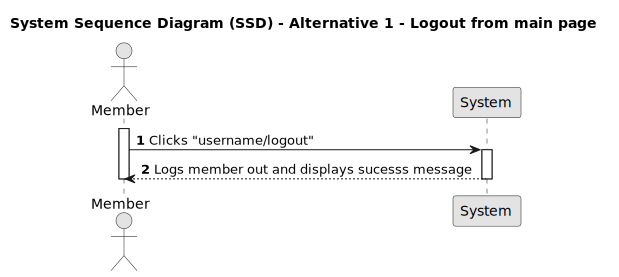
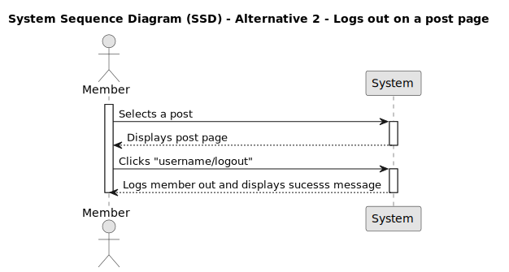
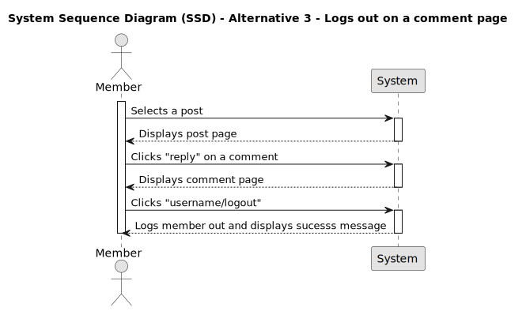

# US 012 - Logout

## 1. Requirements Engineering

### 1.1. User Story Description

As a Member, I want to logout from my account,
so that I can ensure my account's security when I'm finished using the platform.

### 1.2. Customer Specifications and Clarifications

- Should there be a time controller to be logged into an account?

- Should there be a confirmation message when the member logs out?

### 1.3. Acceptance Criteria

- **AC1:** Member must be logged in.

- **AC2:** When the member clicks the logout option, member's session should be terminated.

- **AC3:** Member must be able to logout on the main page.

- **AC4:** Member must be able to logout on the post page.

- **AC6:** Member must be able to logout on the reply page.

- **AC7:** When the logout is made a successful message must be displayed("Logged out! 🤠").

### 1.4. Found out Dependencies

_There is a dependency to "US011 - As a member, I want to login into my account", since member must be logged in._

- System needs to ensure that any pending data changes are saved or discarded appropriately before logging out the member.

### 1.5. Input and Output Data

**Input data**

None

**Output data**

- When the logout is successfully complete "Logged out!" message is displayed.

### 1.6. System Sequence Diagram (SSD)

#### Alternative One

#### Alternative Two

### Alternative Three

### 1.7 Other Relevant Remarks

n/a
