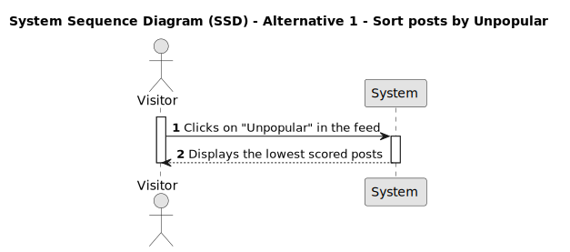
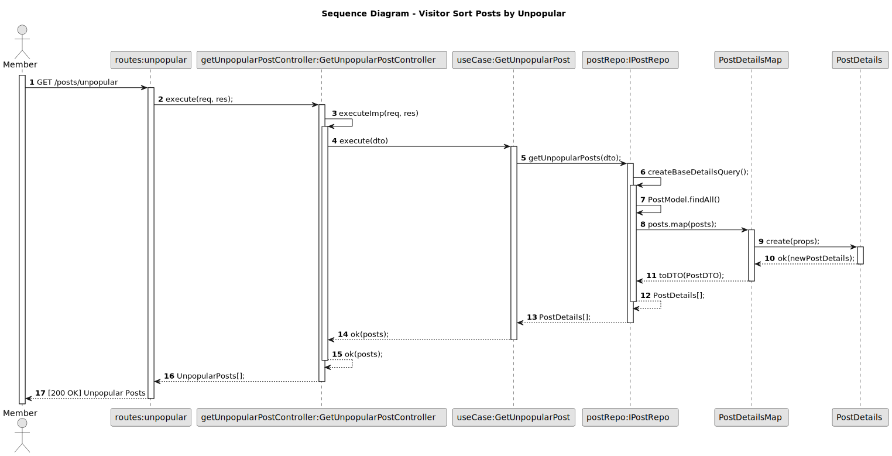

# US 014 - Sort posts by Unpopular

## 1. Requirements Engineering

### 1.1. User Story Description

As a Visitor,
I want to sort posts by unpopular (ascending order),
so that I can easily find and navigate through the posts based on their popularity.

### 1.2. Customer Specifications and Clarifications

- If two posts have the same timestamp, which one should be visible first?
- If two posts have the same score, which one should be visible first?
- If two posts have the same score and timestamp, which one should be visible first?
- How should popular posts be displayed if they have the same score?

### 1.3. Acceptance Criteria

**AC1:** Visitor must be able to access to the DDD Forum.

**AC2:** The maximum number of posts visible to the Visitor must be 15.

**AC3:** Visitor can sort posts by unpopular.

**AC4:** Unpopular posts must be ordered by lowest to highest score.

### 1.4. Found out Dependencies

- _There is a dependency to "US002 - Create a post", since one or more posts must already exists._

* _There is a dependency to "US003 - View posts and their data", since posts must be visible to Visitor._

- _There is a dependency to "US007 - Vote on a post", since the posts must be displayed by score when sorted by popular._

### 1.5 Input and Output Data

**Input Data:**

- Typed data:
  - none
- Selected data:
  - none

**Output Data:**

- Unpopular posts

### 1.6. System Sequence Diagram (SSD)

#### Alternative One

### 1.7 Other Relevant Remarks

N/A

### 2. Sequence Diagram

We created a comprehensive sequence diagram that demonstrates how the sort by unpopular works within our API. This diagram provides a clear and organized visual representation, demonstrating the precise interactions between objects, classes, and methods. It serves as a valuable tool for understanding the flow of data and actions that occur when posts are sorted, allowing for a deeper comprehension of the API workings.

### Sequence Diagram - Sort posts by Unpopular

