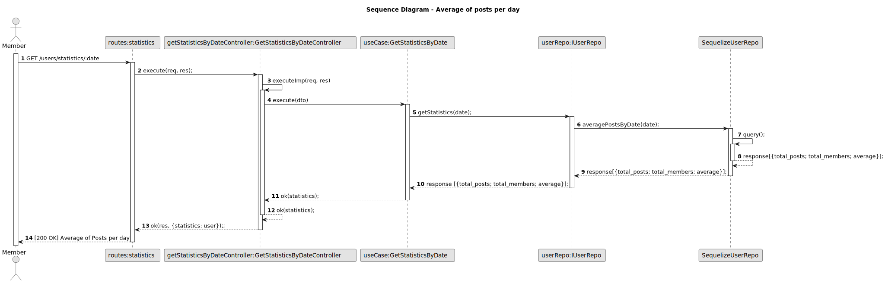

# US 016 - Average of posts by day

## 1. Requirements Engineering

### 1.1. User Story Description

As a Member,
I want to know the average of posts made on a specific day so that I can better understand the posting trends and engagement levels on different days, helping me plan my own content and interactions more effectively.

### 1.2. Customer Specifications and Clarifications

- _"What is desired is to know, on average, how many comments or posts were made by a user on a specific day."_

### 1.3. Acceptance Criteria

**AC1:** The member must be logged in.

**AC2:** The member must be able to navigate to the statistics page when clicking on statistics button on main page.

**AC3:** A "Submit" button must be accessible into the "Average of posts on a Specific Date" section.

**AC4:** A "Refresh" button must be accessible into the "Average of posts on a Specific Date" section.

**AC5:** A The input date should follow the format of "YYYY-MM-DD".

**AC6:** When member inserts the date in the data form on "Average of posts on a Specific Date" section and clicks "Submit" button, average number of posts should be displayed.

**AC7:** The system should calculate the average by summing up the total number of posts and then dividing it by the sum of members who made posts on the selected day.

**AC8:** When there is no data for a specific date, "No data found" message should be displayed on the result field.

**AC9:** When an invalid date format is inserted, the following error message should be displayed : "Inserted date is not valid, please refresh and try again 😎".

**AC10:** When member clicks on "Refresh" button on "Average of posts on a Specific Date" section, data should reset.

### 1.4. Found out Dependencies

- _There is a dependency to "US001 - Register a new accouunt", since the member should be regitered._

- _There is a dependency to "US011 - Login", since the member should be logged in._

- _There is a dependency to "US002 - Create a post", since one or more posts must already exists._

### 1.5 Input and Output Data

**Input Data:**

- Typed data:
  - date: "YYYY-MM-DD"
- Selected data:
  - none

**Output Data:**

- Average of posts on a Specific Date

### 1.6. System Sequence Diagram (SSD)

#### Alternative One

### 1.7 Other Relevant Remarks

N/A

### 2. Sequence Diagram

We created a comprehensive sequence diagram that demonstrates how the "Average of posts by day" works within our API. This diagram provides a clear and organized visual representation, demonstrating the precise interactions between objects, classes, and methods. It serves as a valuable tool for understanding the flow of data and actions that occur when member uses "Average of posts by day" funcionality , allowing for a deeper comprehension of the API workings.

### Sequence Diagram - Average of posts per day

