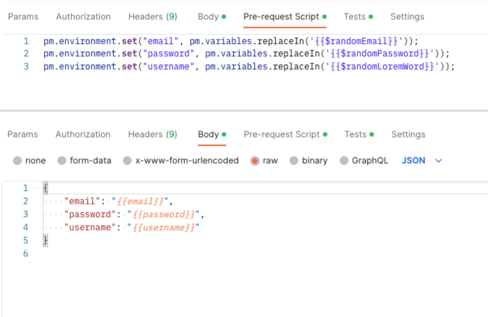
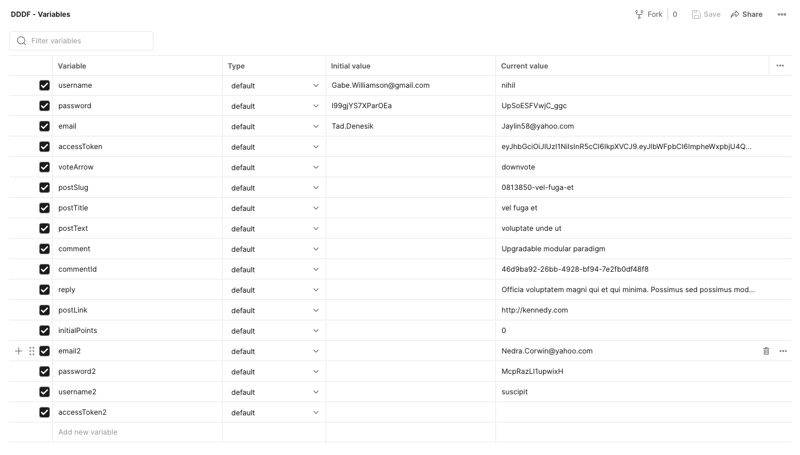
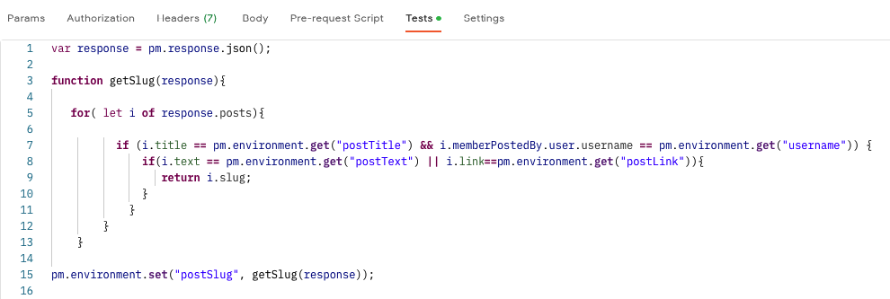
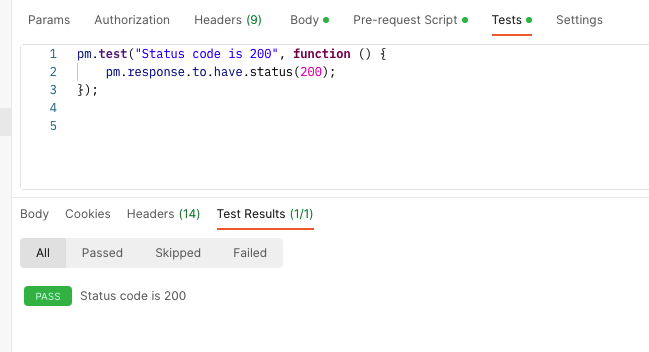
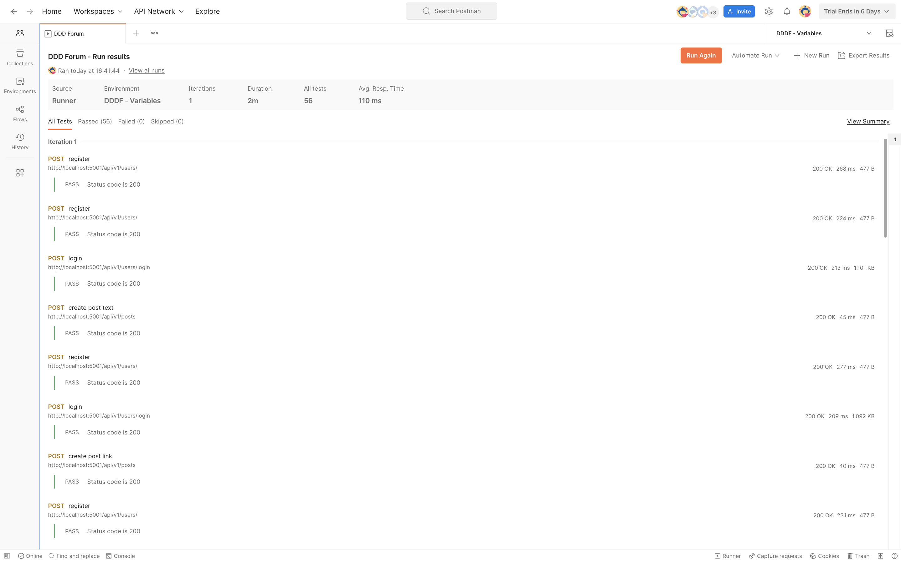

# Postman Request Collection - DDDForum Rest API

**Introduction:**
This is our Postman Request Collection Documentation for the
Domain-Driven Designers Forum API. This RESTful API serves the DDD Forum
(https://dddforum.com/) - a thriving community where individuals can create posts,
share opinions, vote
on contributions, and engage in interactive dialogues
through comments and replies. This guide provides a comprehensive overview
of our Postman Collection, carefully structured
around user stories from the project.

---

&nbsp;&nbsp;&nbsp;&nbsp;

## **Understanding Our Postman Collection**

Our Postman Collection represents a set of HTTP requests
that mirror user interactions with the DDD Forum API.
These requests are built around detailed **user stories (from previous sprint) that cover a wide spectrum of use cases**,
from user registration to posting comments and voting.

The collection is organized in such a way that allows us
to run specific scenarios using Postman's folder run feature efficiently, **simulating real-world interactions** with
the API. This structure does more than emulate a user's
journey through the DDD Forum - **it provides a concrete, scenario-based method for testing and validating the API's performance and functionality.**

&nbsp;&nbsp;&nbsp;&nbsp;

## **Handling Parameters and Request Body**

With the variety of interactions available on the DDD Forum, several API requests **need to address specific parameters or incorporate request bodies from other requests.** To
ensure a seamless connection between different requests,
we have developed a **_global variables environment_**.
This strategy allows us to store specific values from one request and use
them in subsequent ones, thereby maintaining a consistent and efficient data
flow across multiple requests. In register request, like in other requests like: post, comment and reply; to ensure a dynamic testing environment for registration requests, we have utilized Postman's built-in functionalities in **Pre-request Script**, to generate
random data.

&nbsp;&nbsp;&nbsp;&nbsp;

In response to a bug identified in the /posts/recent request (order posts by recency),
we developed a specialized function to accurately locate the correct slug for a
specific post. It's important to note that this strategic implementation, although a workaround, doesn't compromise the integrity of our tests or adulterate the results,
ensuring the preservation of our testing environment's robustness and reliability.

&nbsp;&nbsp;&nbsp;&nbsp;

## **Implementing Tests and Verifying Results**

Ensuring the reliability of our API is a top priority. That's why each request
in our collection includes an integrated test that validates the expected status code
from the response. These tests provide an invaluable first line of defense
against unexpected API behavior and discrepancies between front-end and back-end findings.

&nbsp;&nbsp;&nbsp;&nbsp;

Running all the requests is a crucial part of our iterative testing process,
allowing us to continuously verify the various use cases and maintain alignment
with the evolving requirements of the DDD Forum. The results from these test
runs can be found in the docs/sprintB/postman/test-run folder. Given the
complexity of the test run data, we highly recommend using a JSON viewer to
explore these results.

