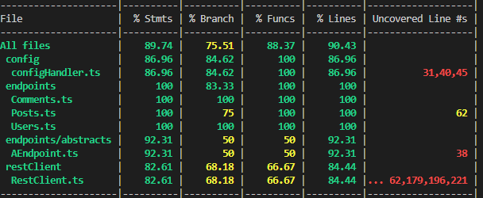
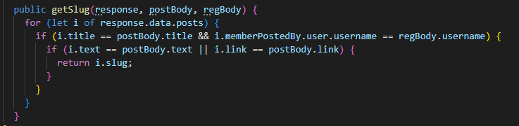
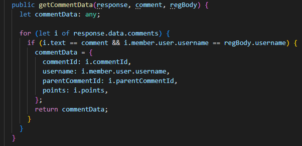
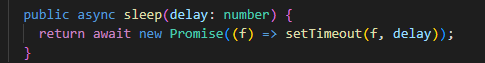

# Final Considerations Sprint B

**Number of tests:** 

**Test Coverage:**

**Developed Functions:** 

**- getSlug:** 

- Motive:
    - We faced a situation where we needed to obtain the slug of a specific post without knowing its position in the array of posts. Unfortunately, the getNewPosts endpoint was not functioning correctly, which further compounded the issue.

 **-getCommentData:** 

- Motive:

    - We encountered a need to retrieve specific data, such as the commentID, from a comment object without prior knowledge of its position in the array of comments. 

**- sleep:**

- Motive: 
    - As we added more tests, we encountered difficulties running all of them successfully. In some cases, when executing random test suites, we encountered issues retrieving variable data, such as commentId, for example. We determined that using "await" alone was not sufficient, so we introduced "sleeps" at the points where the missing data occurred.

**Relevant Remarks:**

- The script used to run the commands: "run-all": "npm run db:delete:dev && npm run db:create:dev && npm run migrate:dev && npm run test -- --runInBand --testPathPattern=api" started taking a bit long on some machines. Conducting these tests with the database doesn't seem like an optimal way to test the application.
- When a post is created, it should return the "slug" of that post instead of just an "OK".
- We noticed differences between the acceptance criteria (AC) we created in Sprint A when analyzing the frontend and the AC when testing the API. We documented these differences for each user story (US) we found.
- Some fields retrieved from the requests made using the endpoints were not functioning properly, such as the childcomment, wasupvotedbyme, and wasdownvotedbyme. 
- US010 was a user story documented in Sprint A regarding the member's profile, but there's no API to test it.
- The standardization of variables as "regBody" and "postBody" helped the members build uniform tests.
- We tried to sequence the order of our tests with "@jest/test-sequencer"; however, we couldn't install it successfully, so we didn't implement it on time.

**Conclusion:**

- The group feels that they have accomplished the main objective of the sprint, which was to document and test the API.
- The major difficulty encountered was in implementing the tests and dealing with the unpredictable behavior of the application in certain user stories.
- Effective communication, organization, and teamwork played a vital role in the success of this sprint.   