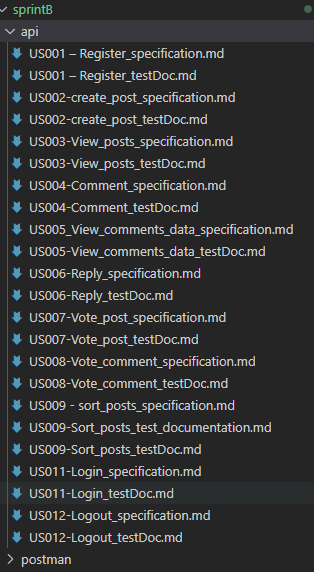
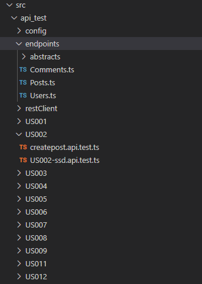
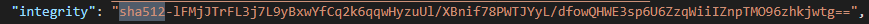

# Introduction Sprint B

## 1. Team members

 - The team consists of students identified in the following table.

| Student Number | Name              |
|----------------|-------------------|
| **1222637**    | Luís Afonso Moita Barros Ferreira |
| **1222649**    | Natali dos Santos Lucas |
| **1222639**    | Nuno Miguel Madaleno de Almeida Pinto  |
| **1222642**    | Ricardo Daniel Pinto Cerqueira |
| **1222643**    | Rita Isabel Santos Castro |
| **1222013**    | Paulo Jorge Fernandes Teixeira |

## 2. Goal 

- To document the API and implement API tests to the full set of functional endpoints (of the backend).

## 3. Documentation Organization: 

## 4. API tests Organization:

## 5. Cryptographic hash function:

- The database employs the SHA-512 cryptographic hash function, providing a highly secure mechanism for generating hash values.