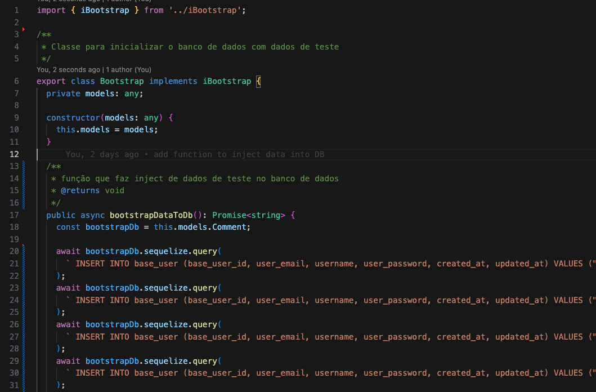
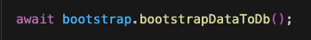
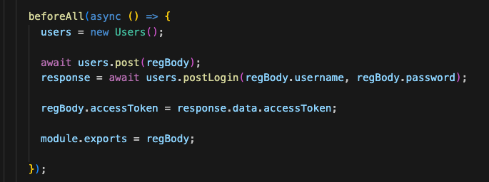
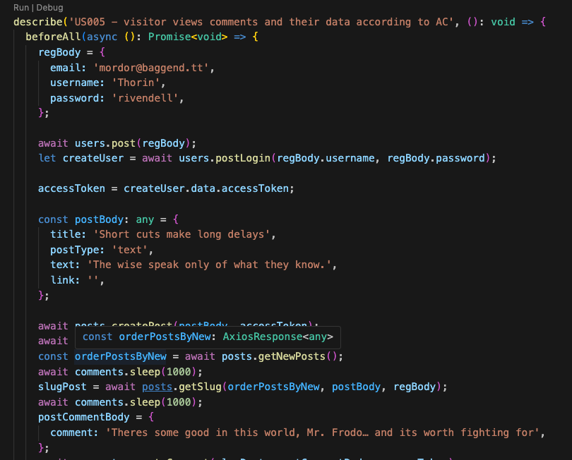
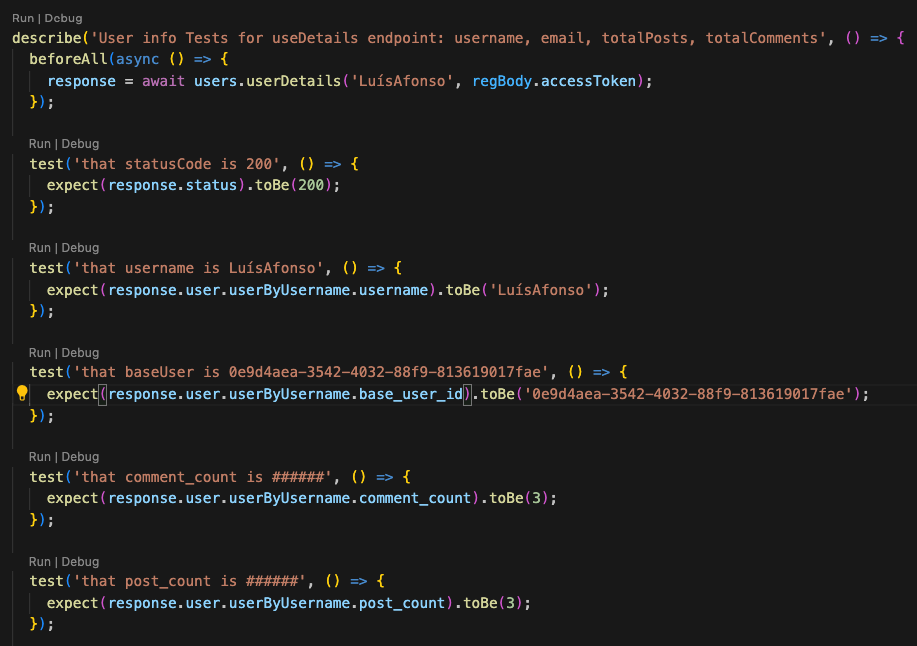

# DB Bootstrap and Data Creation

This documentation provides an overview of the Bootstrap class and its role in preparing the database for testing the DDD Forum application. Following these practices will ensure streamlined testing and more reliable results for your application.

Considering the high demand refactoring the entire suite of existing tests, this approach was implemented in a limited scope as proof of concept. Specifically, it was applied to the `member details (US10) and sorting test suites (US09)`. 

## Bootstrap Class

The `Bootstrap` class provide method to insert data into the database according to the application's needs for testing. It simplifies the setup process and improves test performance by eliminating the need for extensive test preparation.

The database is bootstrapped with essential, this includes the insertion of __posts, comments, votes, and registered users.__

Method: `bootstrapDataToDb(): Promise<string>`

--

## Invocation
The `Bootstrap` class should be invoked before running the test suite to ensure that the database is properly populated with required data. This ensures that the test cases have access to the necessary data without extensive preparation.

### Final result of test script:

npm run db:delete:dev && npm run db:create:dev && npm run migrate:dev && `jest bootstrap.test.ts` && npm run test -- --runInBand --testPathPattern=api

## Data Creation

After invoking the Bootstrap class and ensuring that the database is correctly bootstrapped, we proceeded with additional test setup, including`registering a member and logging in with the member's credentials.

#### Member Registration
Registering a member is crucial for many test cases. After registration, user credentials, including email, username, password, and access token, are `stored in a global object that is exported and accessible across the project``. This ensures that you have a member with valid credentials available for other tests.

## Then vs Now
Then:

Now:
