## 3.1 User Story 013 - Delete User
As a user, I want to delete my profile.
* [User Story 13](../../us013/01.requirements-engineering/readme.md)
* [Tests](../../us013/02.tests/readme.md)

## 3.2 Implementation

### Backend implementation

#### UseCase functions
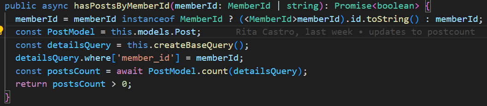
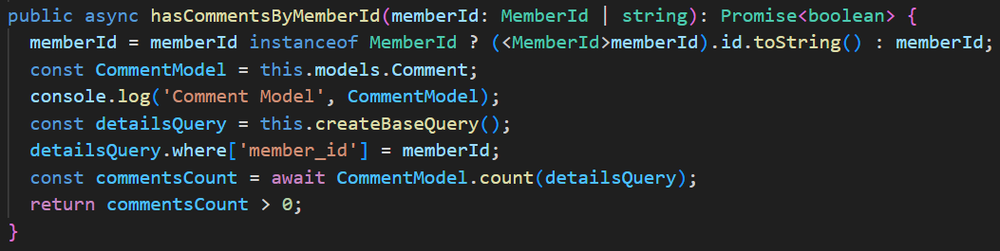

#### ErrorHandling

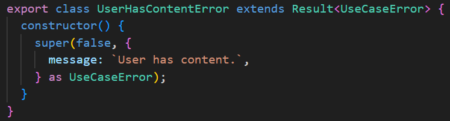

#### Endpoint
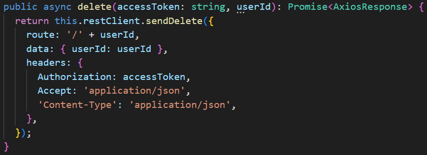

### Frontend implementation

#### Handling API Response

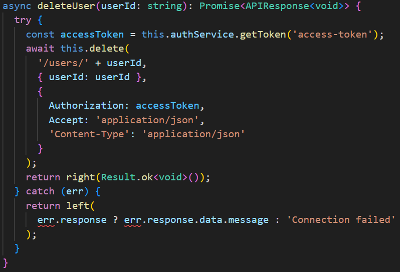

#### ActionsCreators & actions & states

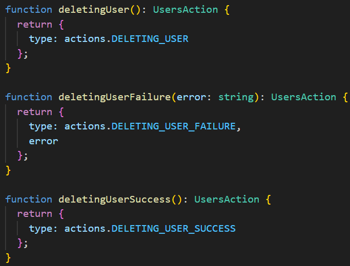
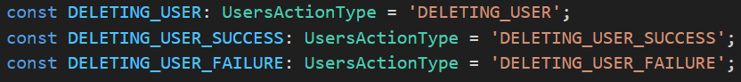
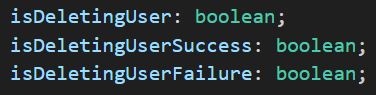

#### Redux Operators

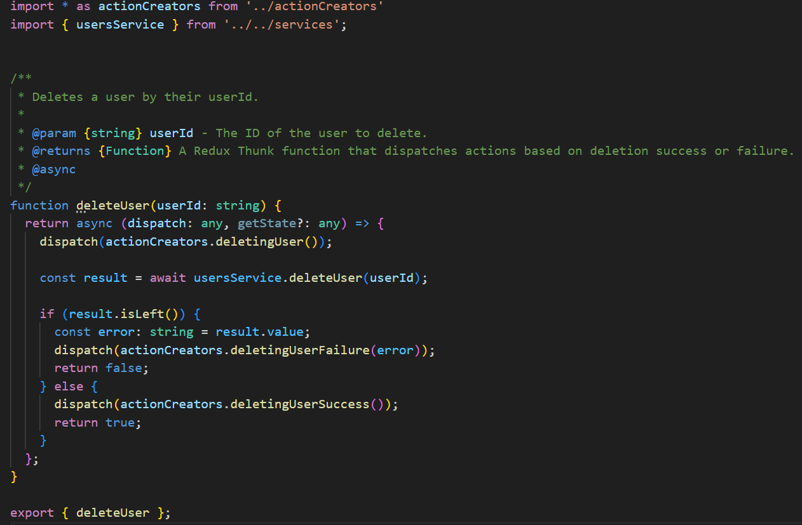

#### MemberPage

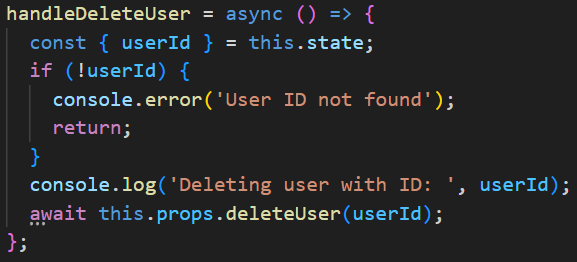
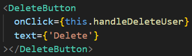
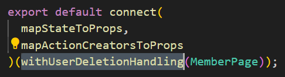

#### HOC

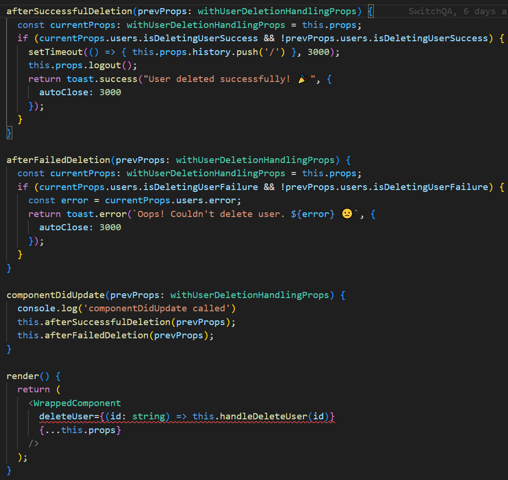

## 3.3 Tests
### Backend Tests
#### Happy path
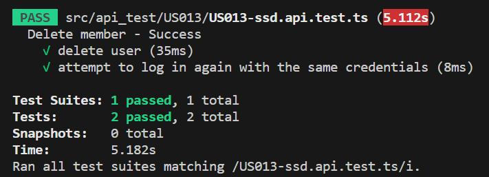

#### Happy path with post/comment error
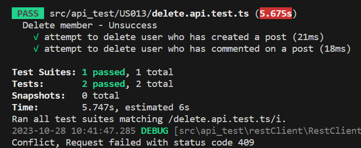

### UI Test
#### User deleted successfully

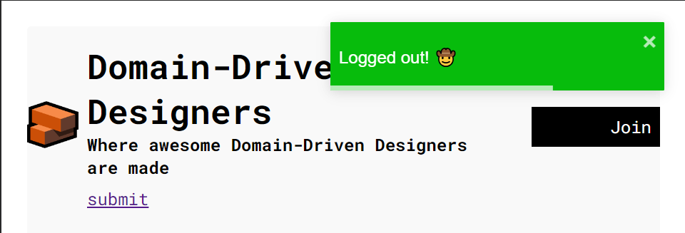

#### User delete error
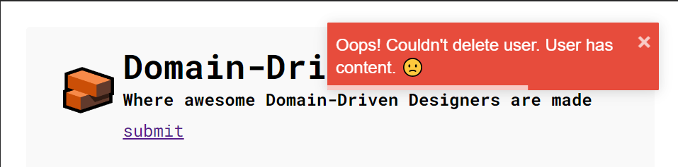

#### Deleted user tries to login
