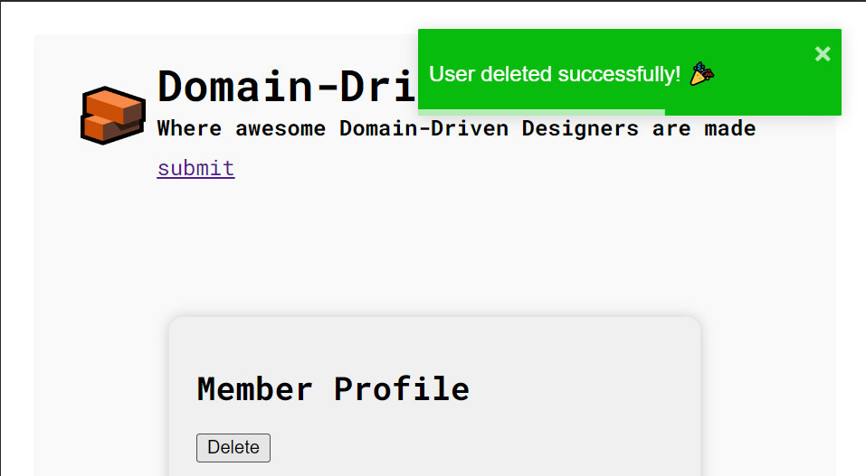
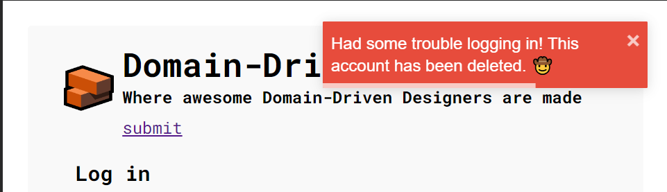

## 3.1 User Story 013 - Delete User
As a user, I want to delete my profile.
* [User Story 13](../../us013/01.requirements-engineering/readme.md)
* [Tests](../../us013/02.tests/readme.md)

## 3.2 Implementation

### Backend implementation

#### UseCase functions

#### ErrorHandling

#### Endpoint

### Frontend implementation

#### Handling API Response

#### ActionsCreators & actions & states

#### Redux Operators

#### MemberPage

#### HOC

## 3.3 Tests
### Backend Tests
#### Happy path

#### Happy path with post/comment error

### UI Test
#### User deleted successfully

#### User delete error

#### Deleted user tries to login
