## 1. US016 - Average of Posts per day

### 1.1 Description

This section aims to create a new functionality that displays average of posts made on a specific day.

### 2. Documentation

[Requirements-Engeneering](../..//sprintA/us016/01.requirements-engeneering/readme.md)

[Tests](../..//sprintA/us016/02.tests/readme.md)

[Gherkin Scenarios](../..//sprintA/us016/04.gherkin-scenarios/readme.md)

### 2.1 Acceptance Criteria in focus

**AC1:** The member must be logged in.

**AC3:** A "Submit" button must be accessible into the "Average of posts on a Specific Date" section.

**AC5:** A The input date should follow the format of "YYYY-MM-DD".

**AC6:** When member inserts the date in the data form on "Average of posts on a Specific Date" section and clicks "Submit" button, average number of posts should be displayed.

**AC7:** The system should calculate the average by summing up the total number of posts and then dividing it by the sum of members who made posts on the selected day.

**AC8** When there is no data for a specific date, "No data found" message should be displayed on the result field.

### 2.2. System Sequence Diagram (SSD)

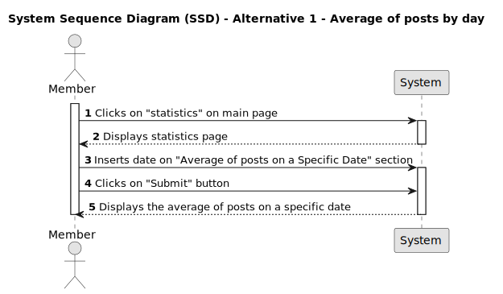

### 2.3 Sequence Diagram (SD)

We created a comprehensive sequence diagram that demonstrates how the Average os Posts functionality works within our API. This diagram provides a clear and organized visual representation, demonstrating the precise interactions between objects, classes, and methods. It serves as a valuable tool for understanding the flow of data and actions that occur when user wants to know the average of posts per member on a specific date, allowing for a deeper comprehension of the API workings.

### 3. Back-End

### 3.1 Route

We have created a new route for this functionality.

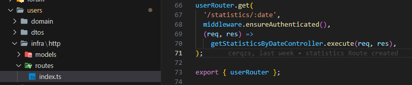

### 3.2 Use Case

A new folder with a new use case, along with its controllers and DTOs, was also created

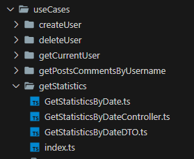

### 3.3 UserRepo

We added the getStatistics method to the IUserRepo interface.

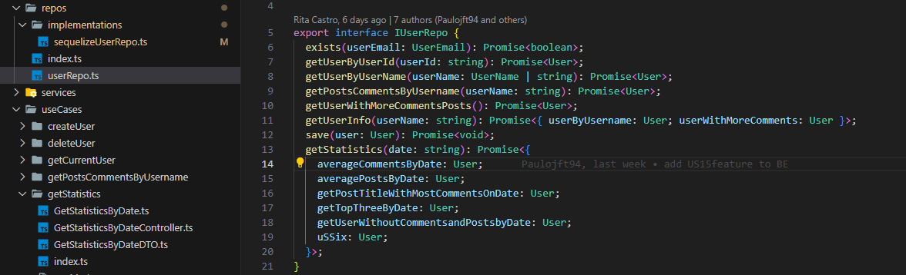

### 3.4 SequelizeUserPostRepo

We added the averagePostsByDate method to the sequelizeUserRepo file. This method receives a date argument of string type and is responsible for querying the database. The method returns an object with the sum of posts as "total_posts," the sum of members as "total_members," and the average as "average_posts_per_member." The average is calculated according to AC7.

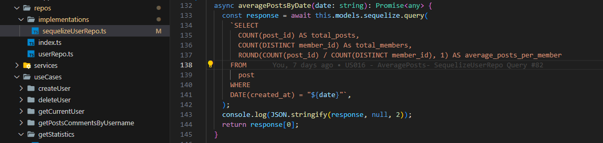

### 4. Back-End API Tests

### 4.1 Endpoint

To perform API tests, we created a specific endpoint for this user story.

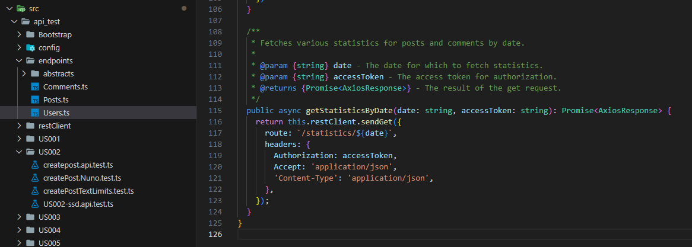

### 4.2 Tests

The Average of Posts per day functionality was successfully tested. These tests were conducted using our bootstrap method, where we inserted SQL lines to execute and verify the tests against the acceptance criteria.

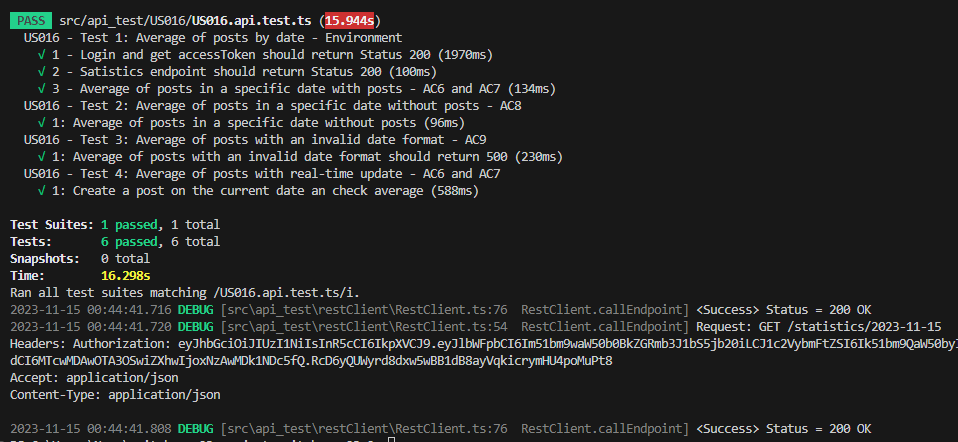

### 5. Front-End

### 5.1 Statistics page link

On the frontend, we added a new statistics link on the main page. To access this page, a member must be logged in, following AC1 and AC2.

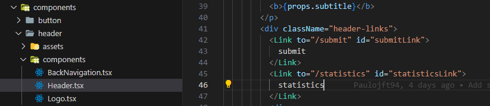

#### Appearance on main page
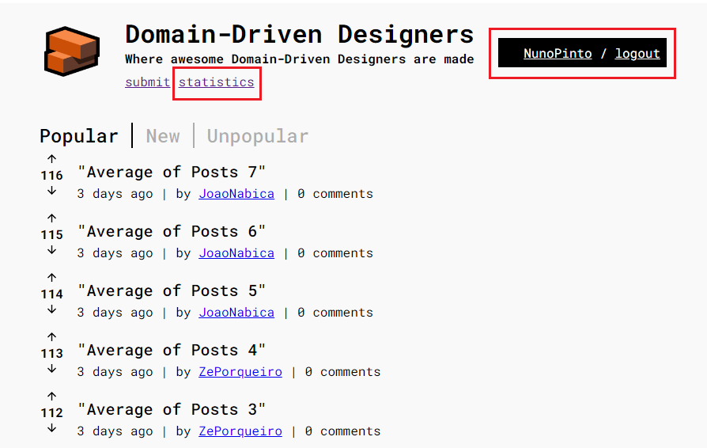

### 5.2 New page - statistics.tsx

We created a new statistics.tsx file and implemented all the related methods that we want to render on the page. The method pertinent to this user story is getAveragePosts. When executed, it returns the "average_posts_per_member" If there are no posts on the selected date, a "No data found" message appears in the result field, fulfilling AC6, AC7, and AC8.

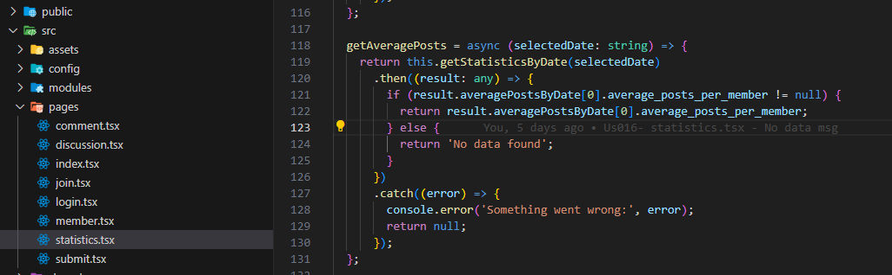

#### Postman - Date with posts - returns average
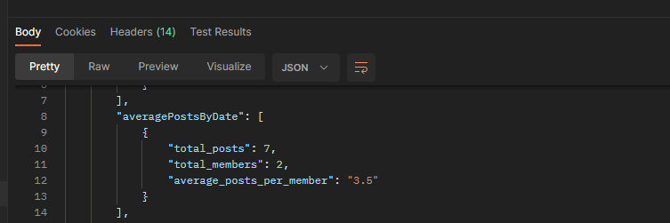

#### Postman - Date without posts - returns null
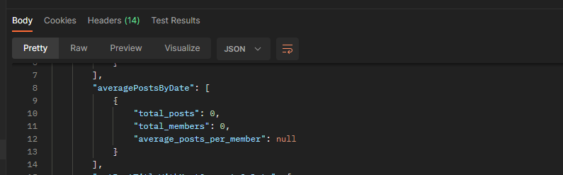

### 5.3 Frontend Appearance

### Average of posts on a Specific Date
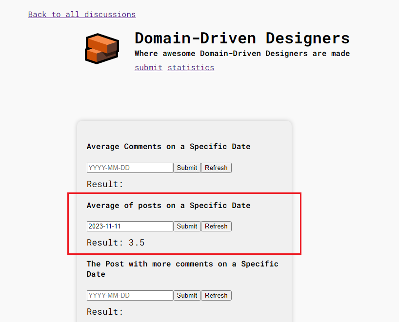

_AC6 - When member inserts the date in the data form on "Average of posts on a Specific Date" section and clicks "Submit" button, average number of posts should be displayed._

### Average of posts on a Specific Date
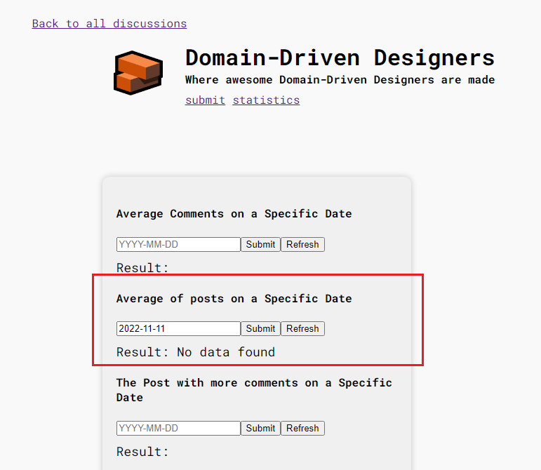

_AC8 - When there is no data for a specific date, "No data found" message should be displayed on the result field._

### 6. Acceptance testings

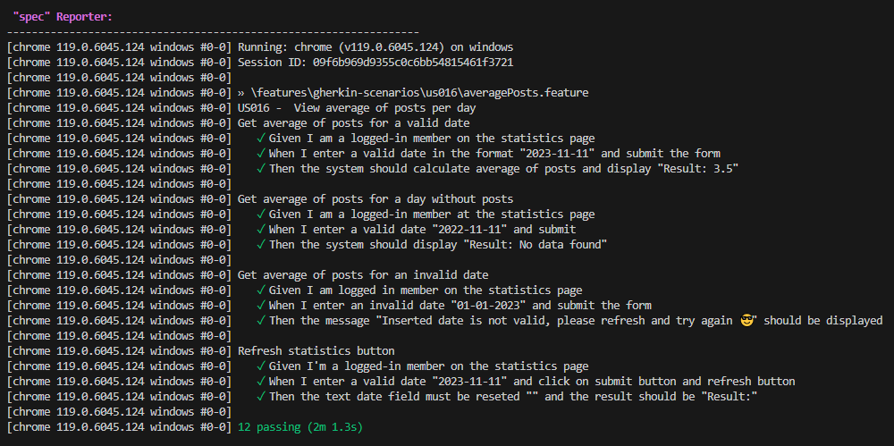

[Gherkin Scenarios](../..//sprintA/us016/04.gherkin-scenarios/readme.md)

