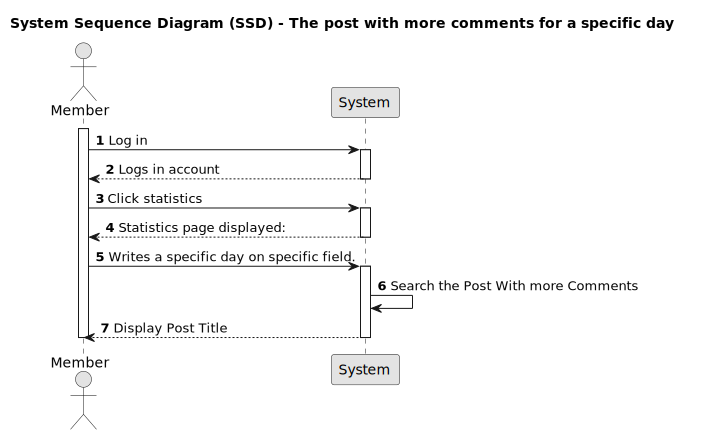
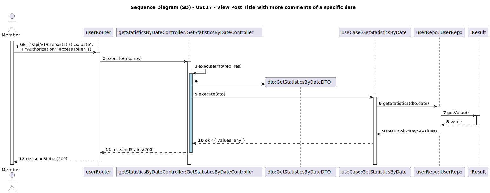

# User Story: As a Member, I want to know the post with more comments for a specific day

## 1. Requirements Engineering

### 1.1. User Story Description

- As a member, I want to know the post with more comments for a specific day so that I can have an idea of the engagement of the community on that day.

### 1.2. Customer Specifications and Clarifications

- Is there the other info besides the post title that should be displayed?
- Is there any specific date format that inputt date should follow?
- what's the criteria in case there's a draw in the number of comments on difernt posts?

### 1.3. Acceptance Criteria

- **AC1:** A new page called statistics must be created to show the statistics info to members only.
- **AC3:** The system must allow the member to enter a date.
- **AC4:** A label "The Post with more comments on a Specific Date" must exist.
- **AC5:** The imput date should follow the format of "YYYY-MM-DD".
- **AC6:** A submit button to request the average of comments must exist.
- **AC7:** A refresh button to update the results must exist.

### 1.4. Found out Dependencies

- The system must have access to the comments and posts data, either through an API or a database.
- Statistics page.
- Member authentication validation to ensure that only members have access to the page.

### 1.5 Input and Output Data

**Input Data:**

- Selected data:
    - Specific day for the post display;

**Output Data:**

- Post title with most comments of the selected day.

### 1.6. System Sequence Diagram (SSD)

#### Alternative One

### 1.7 Other Relevant Remarks

### 1.8 Bugs

n/a

### 2.0 Sequence Diagram

