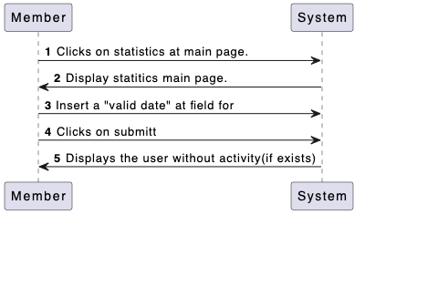
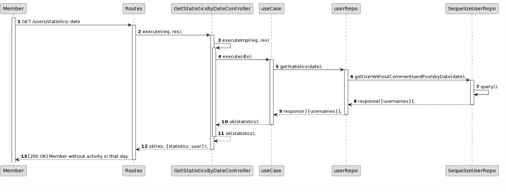
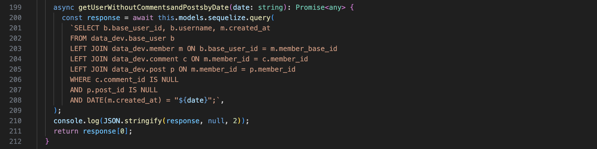
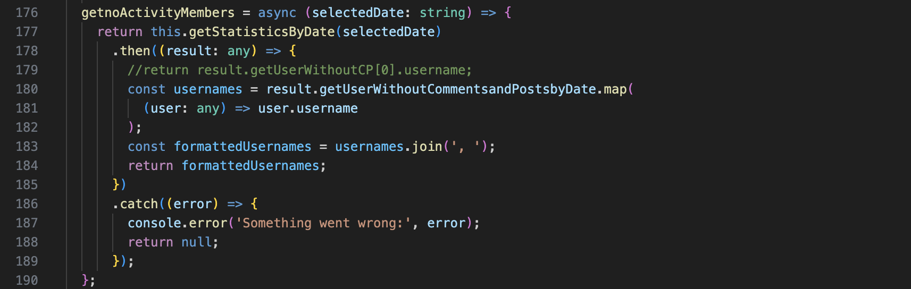
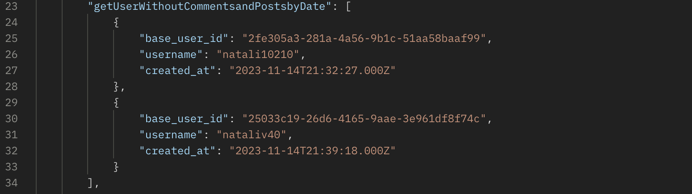
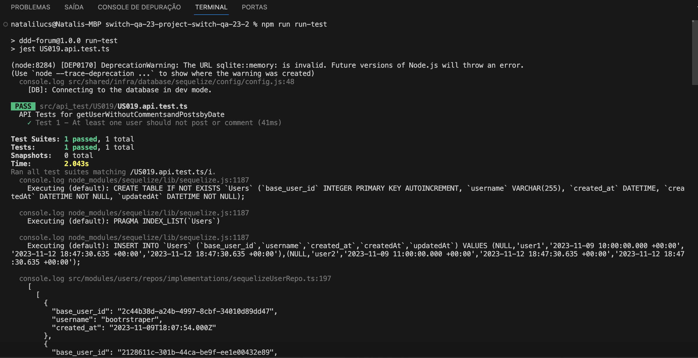
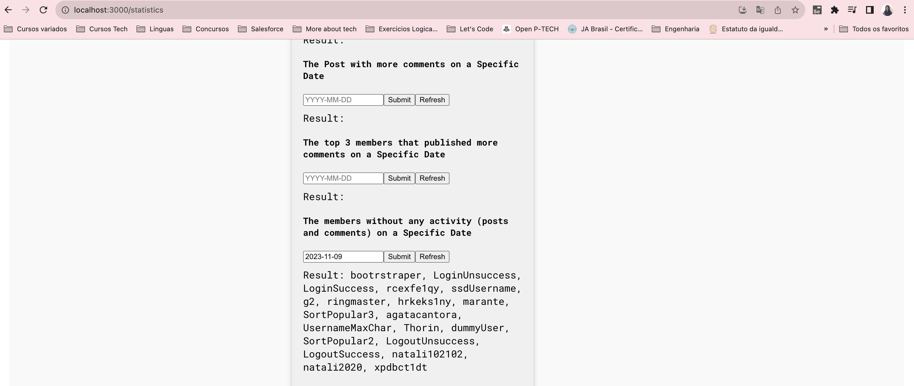
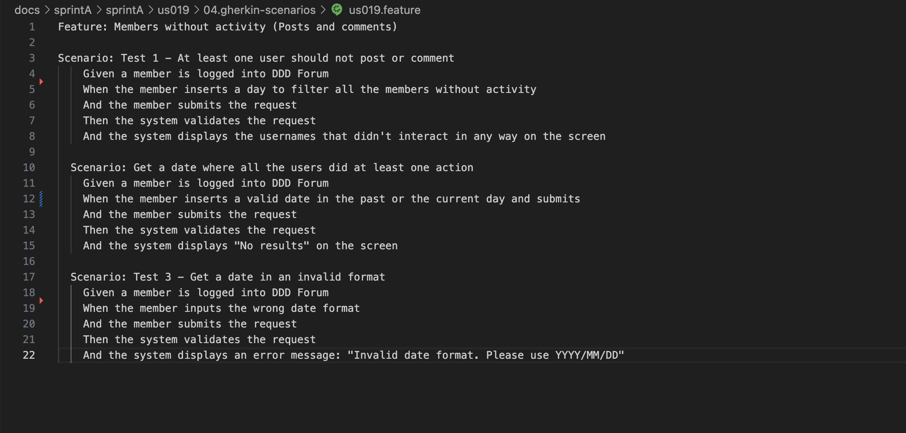

# Presentation #

## US 019 - Members without activity (Posts and comments)##

### 1.1. User Story Description
 
As a Member, I want to know the members without any activity (posts and comments) in specific date.
 
### 1.3. Acceptance Criteria
 
**AC1:** The member must be logged into his account to access the statistic page.
 
**AC2:** When visit the statistic page I should see a field designated for User Without Activity.
 
**AC3:** Must be a insert field for the date of the users without any activity on a specific date.

**AC4:** Must be a submitt button in the Members Without Activity section.
 
**AC5:** If there isn´t users without activity the program must return a message to the user.
 
**AC6:** If a user add or remove a post or comment the list should b update and do not include thar user.
 
**AC7:** When visit the statistic page, the member should see a list indicating the members without activity.
 
**AC8:** The return should be the usernames of the members that didn´t have a post or comment in a specific date.
 
# SSD - System Sequence Diagram

# SD - Sequence Diagram

# Back End - Query

# Back End - Front End - Function

# Test Postman

# Test API

# Front-End Result

# Gherkin scenario

