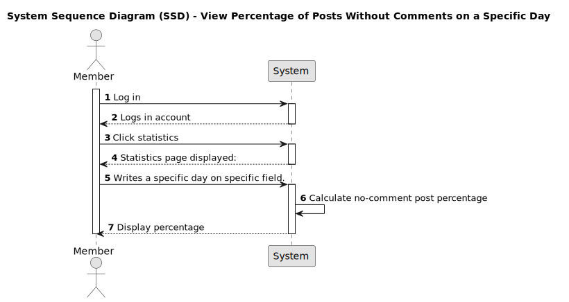
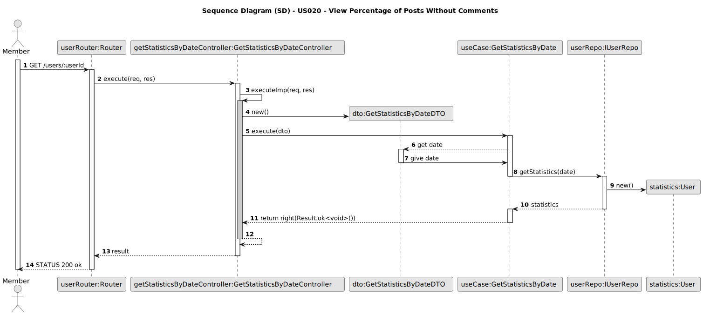

# US 020 - View Percentage of Posts Without Comments

## 1. Requirements Engineering

### 1.1. User Story Description

- As a member, I wish to see the percentage of posts without any comments for a specific day to gauge community interaction.

### 1.2. Customer Specifications and Clarifications

- N/A

### 1.3. Acceptance Criteria

- **AC1:** The member must be logged in.
- **AC2:** The member can select a specific day by inputting it into a text field box showing a placeholder "YYYY-MM-DD".
- **AC3:** The system calculates the percentage of posts without comments for the chosen day.
- **AC4:** The results are displayed below the text field where the date is inputted with the text "Result:" and the value.
- **AC5:** If the date submitted is an invalid format it should prompt the user with a message "Inserted date is not valid, please refresh and try again 😎"
- **AC6:** If the date submitted has no data to show (e.g. no posts were made on that day) the result must show "No data found" 

### 1.4. Found Dependencies

- Dependency on "US011 - Login" for member authentication.
- Dependency on post and comment tracking systems for accurate data.

### 1.5. Input and Output Data

**Input Data:**

- Member's choice of date.

**Output Data:**

- Percentage figure of posts without comments.

### 1.6. System Sequence Diagram (SSD)

#### Alternative One

### 1.7. Other Relevant Remarks

- Consider time zone differences when selecting dates. Dates must be selected relating to website's timezone.

### 1.8. Bugs

- No known bugs at this stage.

### 2.0 Sequence Diagram

