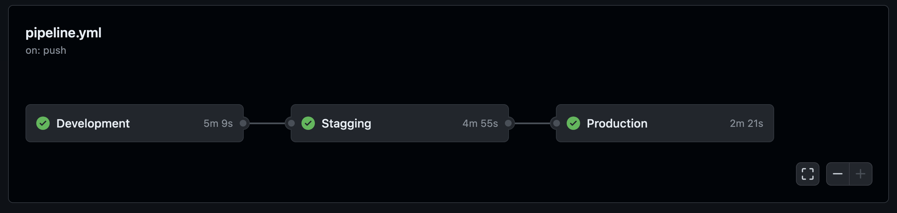

# Postman & Functional Pipeline

--- 

This development involved `extending coverage to every endpoint`. These added tests aimed to verify not only the request and response statuses but also the structure of `request and response bodies, ensuring the presence of mandatory fields and structures`. The tests also compare response values with environment variables for a more comprehensive validation process.

| Information                                       |
|---------------------------------------------------|
| name: DDD Forum                                   |
| timestamp: 2023-11-26T19:31:23.596Z                |
| id: 27862439-263712b1-221b-4e7a-88d4-537cc0c11a43 |
| environment_id: 27864449-98080ba3-a561-4b3e-93ed-ce43c72affad |
| `totalPass: 277`                                    |
| status: finished                                  |
| startedAt: 2023-11-26T19:30:07.199Z                |
| `totalFail: 0`                                      |

<sup><sub> _*full report can be found in docs/sprintF/postman_</sub></sup>


  ##### Examples:
  ```typescript
//from create a comment us004
pm.test("slug matches the post slug in the request URL", function () {
  const postSlug = pm.variables.get("postSlug");
  const commentSlug = pm.request.url.query.get("slug");

  pm.expect(commentSlug).to.equal(postSlug);
});

//from member details us010  
pm.test("Validate that userByUsername has the required fields", function () {
    const responseData = pm.response.json();

    pm.expect(responseData.user.userByUsername).to.exist;
    pm.expect(responseData.user.userByUsername.base_user_id).to.exist;
    pm.expect(responseData.user.userByUsername.username).to.exist;
    pm.expect(responseData.user.userByUsername.user_email).to.exist;
    pm.expect(responseData.user.userByUsername.comment_count).to.exist;
    pm.expect(responseData.user.userByUsername.post_count).to.exist;
});
  ```

<br/>

### Pre-commit


A pre-commit mechanism has been established to automatically `run tests for key features` of the DDD Forum. This ensures that tests are executed to key functionalities prior to committing changes, contributing to the `maintenance of code quality and the reliability of the DDD Forum's critical functionalities`.

The pre-commit mechanism was configured to execute two sets of scenarios for Postman requests using **Newman**.
#### Scenario #1

- `Register` _4 tests_
- `Login` _3 tests_
- `Create a Post`* _2 tests_
- `Create a Comment`* _9 tests_
- `Reply to a Comment` _4 tests_
- `Vote Comment` _3 tests_
- `Vote Post` _4 tests_
- `Member Details` _9 tests_

  <sup><sub> _viewPosts/viewComments requests are also executed_</sub></sup>


#### Scenario #2
- `Register` _4 tests_
- `Login` _3 tests_
- `Member Details` _9 tests_
- `Delete user` _3 tests_

___

```bash
newman run https://api.postman.com/collections/27864449-af25a6e9-a5c0-4f4f-a5fc-e67f1b176d50?access_key=PMAT-01HH0CAX2YAPCXERGFFKGCYRDH 
```


 <br/>


|                     | Executed | Failed |
|---------------------|----------|--------|
| Iterations          | 1        | 0      |
| Requests            | 14       | 0      |
| Test Scripts        | 14       | 0      |
| Prerequest Scripts  | 9        | 0      |
| Assertions          | 62       | 0      |

|`Pre-commit info` | |
|---------------------|----------|
| Total Run Duration (milliseconds)   | 1576                  |       
| Total Data Received (approx)         | 2.62kB | 
| Average Response Time (milliseconds) | 90 [Min: 12ms, Max: 266ms, S.D.: 90ms]                   |       


<br/>
<details>
  <summary>Newman logs</summary>

### Scenario 1

### Register
- **Request:** 
  - Method: POST 
  - URL: http://localhost:5001/api/v1/users/
  - Expected Response: 200 OK, 924B, 266ms
- **Assertions:**
  - Response status code is 200
  - Response is not empty
  - Response has the expected message 'OK'
  - Response time is within an acceptable range

### Login
- **Request:**
  - Method: POST 
  - URL: http://localhost:5001/api/v1/users/login
  - Body: 
    ```
    'Mayra'
    'WGsUnMjWM6W3q6g'
    ```
  - Expected Response: 200 OK, 1.55kB, 211ms
- **Assertions:**
  - Status code is 200
  - Access token is not empty and is a string
  - Refresh token is not empty and is a string

### Create Post Text
- **Request:**
  - Method: POST 
  - URL: http://localhost:5001/api/v1/posts
  - Expected Response: 200 OK, 924B, 62ms
- **Assertions:**
  - Status code is 200

### View Posts
- **Request:**
  - Method: GET 
  - URL: http://localhost:5001/api/v1/posts/recent
  - Expected Response: 200 OK, 1.27kB, 12ms
- **Assertions:**
  - Status code is 200

### Create a Comment
- **Request:**
  - Method: POST 
  - URL: http://localhost:5001/api/v1/comments?slug=4551656-nemo-non-voluptatem
  - Expected Response: 200 OK, 924B, 62ms
- **Assertions:**
  - Response status code is 200
  - Response body is not empty
  - Comment slug matches the post slug in the request URL
  - Comment is successfully created

### View Comments
- **Request:**
  - Method: GET 
  - URL: http://localhost:5001/api/v1/comments?slug=4551656-nemo-non-voluptatem
  - Expected Response: 200 OK, 1.32kB, 12ms
- **Assertions:**
  - Status code is 200
  - Response has the 'comments' array
  - Comments array is not empty
  - Verify that the 'member' object has the required fields - reputation and user
  - Reputation is a non-negative integer

### Reply to Comment
- **Request:**
  - Method: POST 
  - URL: http://localhost:5001/api/v1/comments/2faa8034-3f2d-4ca1-8bcd-bb046d6d5629/reply?slug=4551656-nemo-non-voluptatem
  - Expected Response: 200 OK, 924B, 61ms
- **Assertions:**
  - Status code is 200
  - Response body is not empty
  - Response time is within acceptable range
  - Verify that the response message is 'OK'

### Vote Comment
- **Request:**
  - Method: POST 
  - URL: http://localhost:5001/api/v1/comments/2faa8034-3f2d-4ca1-8bcd-bb046d6d5629/upvote
  - Expected Response: 200 OK, 924B, 35ms
- **Assertions:**
  - Response status code is 200
  - Response body is not empty and is equal to 'OK'
  - Request method is POST

### Upvote Post
- **Request:**
  - Method: POST 
  - URL: http://localhost:5001/api/v1/posts/upvote
  - Expected Response: 200 OK, 924B, 35ms
- **Assertions:**
  - Response status code is 200
  - Response body is 'OK'
  - Response time is within an acceptable range
  - Verify that the response does not contain any error messages or exceptions

### Member Details
- **Request:**
  - Method: GET 
  - URL: http://localhost:5001/api/v1/users/info/Mayra
  - Expected Response: 200 OK, 1.26kB, 20ms
- **Assertions:**
  - Status code is 200
  - Validate that rank_comment_count is a non-negative integer
  - userByUsername is an object and not empty
  - Response status code is 200
  - Validate that userByUsername has the required fields
  - Validate that userWithMoreComments is an array and not empty
  - rank_comment_count and rank_post_count are non-negative integers
  - Verify that the response body is an object and not empty
  - Verify that the 'userWithMoreComments' array is present and contains at least one element

### Scenario 2

### Register
- **Request:**
  - Method: POST 
  - URL: http://localhost:5001/api/v1/users/
  - Expected Response: 200 OK, 924B, 236ms
- **Assertions:**
  - Response status code is 200
  - Response is not empty
  - Response has the expected message 'OK'
  - Response time is within an acceptable range

### Login
- **Request:**
  - Method: POST 
  - URL: http://localhost:5001/api/v1/users/login
  - Body: 
    ```
    'Micaela'
    'BtWBdYehm2FAGDf'
    ```
  - Expected Response: 200 OK, 1.54kB, 205ms
- **Assertions:**
  - Status code is 200
  - Access token is not empty and is a string
  - Refresh token is not empty and is a string

### Member Details
- **Request:**
  - Method: GET 
  - URL: http://localhost:5001/api/v1/users/info/Micaela
  - Expected Response: 200 OK, 1.25kB, 16ms
- **Assertions:**
  - Status code is 200
  - Validate that rank_comment_count is a non-negative integer
  - userByUsername is an object and not empty
  - Response status code is 200
  - Validate that userByUsername has the required fields
  - Validate that userWithMoreComments is an array and not empty
  - rank_comment_count and rank_post_count are non-negative integers
  - Verify that the response body is an object and not empty
  - Verify that the 'userWithMoreComments' array is present and contains at least one element

### User by userId
- **Request:**
  - Method: DELETE 
  - URL: http://localhost:5001/api/v1/users/b30026cd-fd56-43ad-974f-9be3b2c333fd
  - Expected Response: 200 OK, 924B, 37ms
- **Assertions:**
  - Response status code is 200
  - Response message is 'OK'
  - Deleted user's data is not accessible
</details>
<br/>

  ## `Functional Pipeline`


Our CI pipeline automates the sequential execution of the application setup and testing across various environments following each commit to the master branch: `Development` —> `Stagging` —> `Production`.

Specifically, the Development Job is responsible for running unit tests, the Staging Job performs acceptance tests, and the Production Job conducts smoke tests, incorporating the two Newman scenarios described above.

<sup><sub> _*Acceptance tests currently being migrated_</sub></sup>

<sup><sub>[Configuration file .yml](https://github.com/Departamento-de-Engenharia-Informatica/switch-qa-23-project-switch-qa-23-2/blob/master/.github/workflows/pipeline.yml)</sub></sup>





  