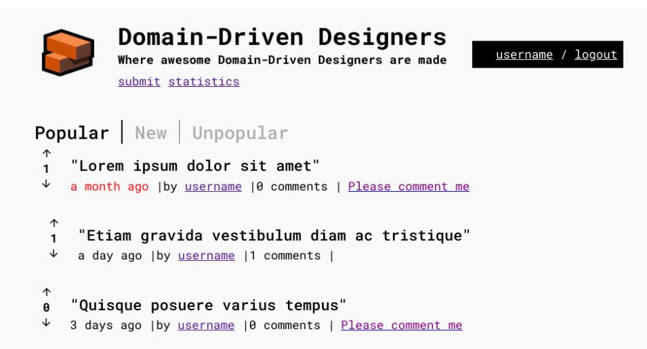
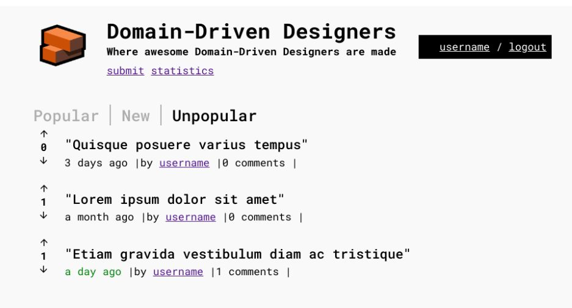
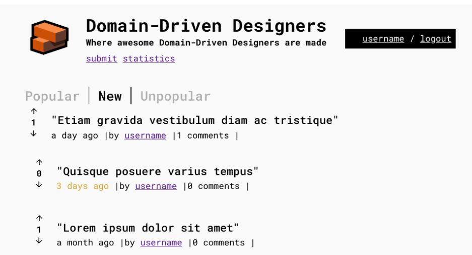

## Analysis and Documentation

The common ground linking three of these scenarios is the classification of posts according to their age in days, coupled with the color-coded representation of the post timestamp. Each scenario introduces specific conditions tied to the post's timestamp (such as being older than five days, less than two days, or falling within the
 range of two to seven days old) and assigns a corresponding color to the date text (red, green, yellow). As for the fourth scenario, we identified that it could seamlessly integrate into the same files as it pertained to the content within the post row structure.

We delved into each user's narrative, examining their needs while considering the specific acceptance criteria for and their dependencies.

- [US023](../../us023/01.requirements-engineering/readme.md)
- [US024](../../us024/01.requirements-engineering/readme.md)
- [US025](../../us025/01.requirements-engineering/readme.md)
- [US026](../../us026/01.requirements-engineering/readme.md)

We then created our Gherkin scenarios to offer a clear and structured method of articulating and defining the expected software behavior in a readable format. These scenarios served as a future guide for our acceptance tests, providing a comprehensible framework for understanding the software's anticipated functionalities and serving as a reference point for validating system behavior.

- [Gherkin Scenarios](https://switchqa.github.io/?feature=redTextPostsTimestamp.feature)


## Development

Since these are front-end characteristics related to post display, the React component [PostMeta.tsx](../../../../public/app/src/modules/forum/components/posts/post/components/PostMeta.tsx) incorporates logic to visually distinguish posts based on their timestamp. The implementation aligns with the specified criteria for different filters—popular, unpopular, and recent posts—each with distinct age thresholds and corresponding text color codes.

The component dynamically determines the color of the post date text based on the post timestamp and active filters. For instance:

```Typescript
  const postAge = moment(props.createdAt);
  const postAgeDif = moment().diff(postAge, 'days');

  let colorClass = '';
  if (props.isLoggedIn) {
    if (props.activeFilter === 'NEW' && postAgeDif >= 3 && postAgeDif < 7) {
      colorClass = 'yellow-text';
    } else if (props.activeFilter === 'POPULAR' && postAgeDif > 5) {
      colorClass = 'red-text';
    } else if (props.activeFilter === 'UNPOPULAR' && postAgeDif < 2) {
      colorClass = 'green-text';
    }
  }
```

Further down in the code, there's a condition showCommentInvite that checks if the user is logged in, the active filter is set to 'POPULAR', and there are no comments on the post.

```Typescript
const showCommentInvite =
    props.isLoggedIn &&
    props.activeFilter === 'POPULAR' &&
    props.numComments === 0;
```

When showCommentInvite evaluates to true, it renders a link with a nested span containing the text "Please comment me." Within this span, the class purple-text is applied.

```Typescript
        {`${props.numComments} comments`} |
        {showCommentInvite && (
          <span>
            <Link
              to={`/discuss/${props.slug}`}
              className="comment-link"
            >
              <span className="purple-text">Please comment me</span>
            </Link>
          </span>
        )}
```

Regarding the timestamp's color variation, the `colorClass` is applied dynamically to the span containing the `createdAt`` timestamp, altering its text color accordingly.
```Typescript
        <span className={colorClass}>{moment(props.createdAt).fromNow()}</span>{' '}
```
   
The [PostMeta.sass](../../../../public/app/src/modules/forum/components/posts/post/styles/PostMeta.sass) file was used to structure and define the visual styles for various elements within the React component. Each class within the SASS code serves a distinct purpose in styling elements associated with different aspects of the post display:

```Typescript
.post-row-content
 
.yellow-text 
  color: #daa520

.red-text
  color: red

.green-text 
  color: green

.purple-text 
  color: purple
```

Text color variations such as `.yellow-text`, `.red-text`, `.green-text` and `.purple-text` are specified, allowing dynamic color assignment based on different conditions like post age or popularity.


### Front-end result:






## Acceptance Tests

Acceptance tests for every user story were created using WebdriverIO. We constructed a suite of tests that comprehensively validate the interactions outlined in each user story. This approach ensured that every aspect of the software aligned with the specified requirements and user expectations.

- [Acceptance Test Example](https://github.com/Departamento-de-Engenharia-Informatica/switch-qa-23-project-acceptancetests-switch-qa-23-2/blob/main/features/step-definitions/us025-steps/us025-steps.ts)


 ### Seeding and Database Connection
 
The purpose of the [Seed](https://github.com/Departamento-de-Engenharia-Informatica/switch-qa-23-project-acceptancetests-switch-qa-23-2/tree/main/database/seeds) in the acceptance tests is to be the insertion of data into a database for testing purposes. By inserting predefined data into the database, it ensures that specific scenarios or conditions exist for testing different functionalities or behaviors of the application.

This approach allows for consistent and controlled data setup, ensuring that the database contains predefined information required for specific test cases to be executed reliably and consistently. 

Going forward, our aim is to standardize these data injections by establishing a comprehensive database connection and adopting the bootstrap method previously developed for API testing.