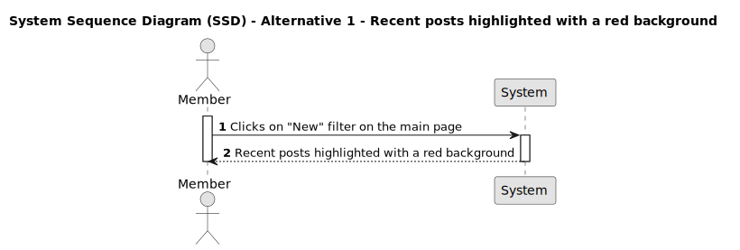

# US 022 - Recent posts highlighted with a red background

## 1. Requirements Engineering

### 1.1. User Story Description

As a member, when I look at the recent posts, I want posts that have less than 1/3 of the comments from the 
post with the highest comments on the webpage to be highlighted with a red background.

### 1.2. Customer Specifications and Clarifications

- Is this functionality only visible to members?

### 1.3. Acceptance Criteria

**AC1:** The member must be logged in.

**AC2:** The member must be able to sort posts by new.

**AC3:** The posts that have less than 1/3 of the comments from the post with the highest comments on the webpage, must be highlighted with a red background

### 1.4. Found out Dependencies

- _There is a dependency to "US001 - Register a new accouunt", since the member should be regitered._

- _There is a dependency to "US011 - Login", since the member should be logged in._

- _There is a dependency to "US002 - Create a post", since one or more posts must already exists._

- _There is a dependency to "US004 - Write a comment on a post", since posts must have comments._

- _There is a dependency to "US009 - Sort posts by popular or new", since the posts must be sorted by New._

### 1.5 Input and Output Data

**Input Data:**

- Typed data:
  - none
- Selected data:
  - none

**Output Data:**

- Recent posts that have less than 1/3 of the comments from the post with the highest comments on the webpage to be highlighted with a red background

### 1.6. System Sequence Diagram (SSD)

#### Alternative One

### 1.7 Other Relevant Remarks

N/A
