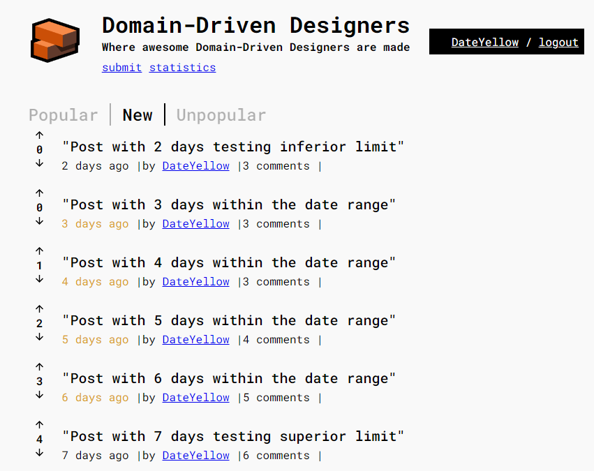

# Black Box Testing

## Introduction

Black box testing is a software testing approach that focuses on the external functionality of a system without knowledge of its internal source code. This type of testing evaluates the system's behavior based on provided inputs and expected outputs, without considering internal logic.

## Objective

The primary goal of black box testing is to ensure that the software meets specified functional requirements and that its features operate as expected.

## Used Technique

1. **Boundary Value Testing:**
- Evaluates the system's behavior at the limits of allowed inputs.

## 3. Examples

### 3.1 US 022 - Recent posts highlighted with a red background

In this case, posts with different numbers of comments were inserted into the database to test boundary values.

The post with the most comments is the first one with 6 comments.

Claculate 1/3 of highest commented post:  6 x 1/3 = 2.

In this scenario, only the posts with less than 2 comments will appear in red, as can be observed in the image below, complying with AC3.

_**AC3:** The posts that have less than 1/3 of the comments from the post with the highest comments on the webpage, must be highlighted with a red background_

### 3.2 US 025 - Display color yellow on date text on Recent Posts Filter

In this case, posts with different dates were inserted into the database to test ranges and its boundary values.

In this scenario, only the date of posts with more than 2 days and less than 7 days will appear in yellow as can be observed in the image below, complying with AC2.

_**AC2:** Posts older than two days and newer than seven days must have the date stamp in yellow text._

