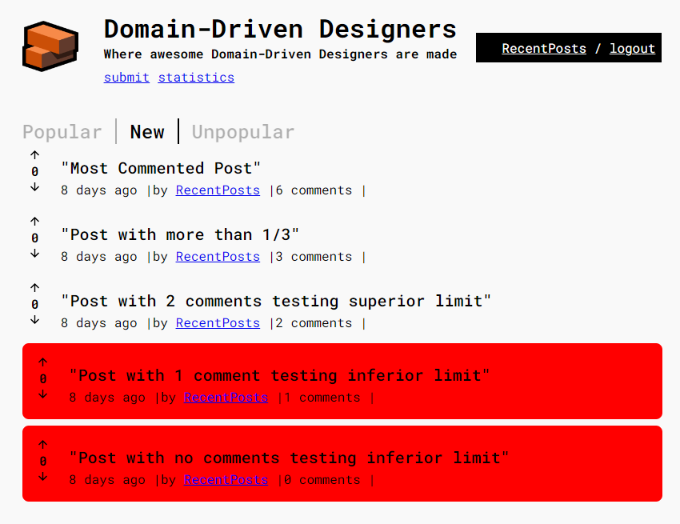
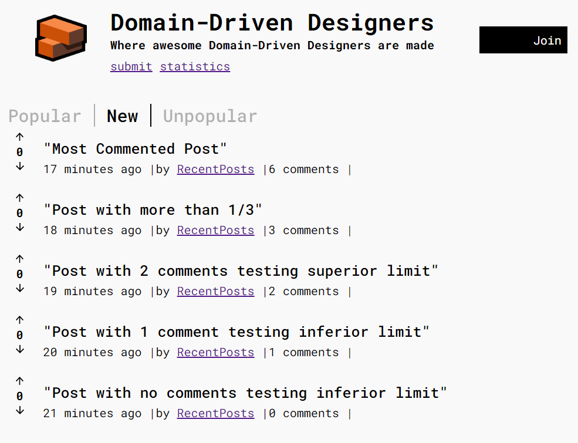
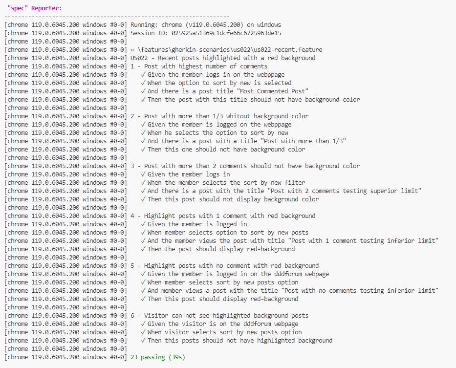

## 1. US 022 - Recent posts highlighted with a red background

### 1.1 Description

This feature aims to improve the user experience for members by implementing a functionality that highlights recent posts with a red background. Posts meeting the criteria of having fewer than 1/3 of the comments in comparison to the post with the highest number of comments on the webpage will be emphasized.

### 2. Documentation

[Requirements-Engeneering](../01.requirements-engeneering/readme.md)

[Tests](../02.tests/readme.md)

[Gherkin Scenarios](../04.gherkin-scenarios/us022-recent.md)

### 2.1 Acceptance Criteria

**AC1:** The member must be logged in.

**AC2:** The member must be able to sort posts by new.

**AC3:** The posts that have less than 1/3 of the comments from the post with the highest comments on the webpage, must be highlighted with a red background.

### 2.2. System Sequence Diagram (SSD)

### 3. Black Box Testing

### 3.1 Boundary testing technique

The boundary value test was used to perform black box testing.
In this case, posts with different numbers of comments were inserted into the database:

- 6 comments 
- 3 comments
- 2 comments
- 1 comment
- 0 comments

The post with the most comments is the first one with 6 comments.

Claculate 1/3 of highest commented post:  6 x 1/3 = 2.

In this scenario, only the posts with fewer than 2 comments will appear in red, as can be observed in the image below, complying with AC3.

_**AC3:** The posts that have less than 1/3 of the comments from the post with the highest comments on the webpage, must be highlighted with a red background_

_**AC1:** The member must be logged in._

### 4. Acceptance testings

[Gherkin Scenarios](../04.gherkin-scenarios/us022-recent.md)

